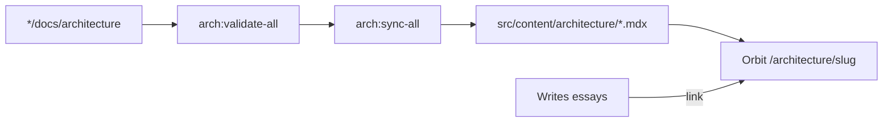

# Architecture sync pipeline

```mermaid
flowchart LR
  Projects[*/docs/architecture] --> Validate[arch:validate-all]
  Validate --> Sync[arch:sync-all]
  Sync --> Arch[src/content/architecture/*.mdx]
  Arch --> Orbit[Orbit /architecture/slug]
  Essays[Writes essays] -->|link| Orbit
```
