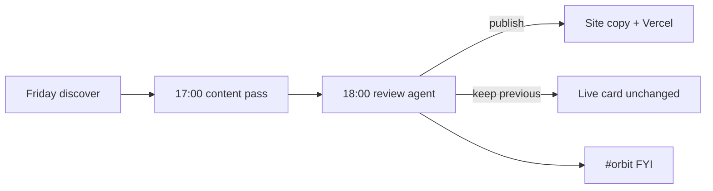

# Field card weekly gate (Orbit)

The review agent is the gate. You do not Approve in Slack unless that agent misses.

## Normal week

1. Friday ~15:00 — CI opens a discovery PR (no Slack ping).
2. Friday 17:00 — content agent may edit the card; leaves the PR open.
3. Friday 18:00 — **review agent** compares proposed HTML to live, then publishes or keeps the previous card.
4. Slack gets a short Approved / Declined note. No buttons required.

## Backup

If the review agent misses, Saturday/Monday watchdog can still post **Open the new card / Approve / Decline**.

## Cards

| Card | Content repo | Orbit path | Soft URL |
|---|---|---|---|
| Agentic AI | AlexTouvras/agentic-ai-field-card | public/field-card/index.html | /field-card/ |
| Data Analytics | AlexTouvras/data-analytics-field-card | public/analytics-field-card/index.html | /analytics-field-card/ |
| Technology Delivery | AlexTouvras/technology-delivery-field-card | public/delivery-field-card/index.html | /delivery-field-card/ |

Signing secret must match across content repos + Orbit (`WEEKLY_WRITE_SECRET` / `CRON_SECRET` / `FIELD_CARD_ACTION_SECRET`).
GitHub token on Orbit must be allowed to read + merge PRs on **all registered** field-card repos (`FIELD_CARD_GITHUB_TOKEN` if the default token is Orbit-only).
