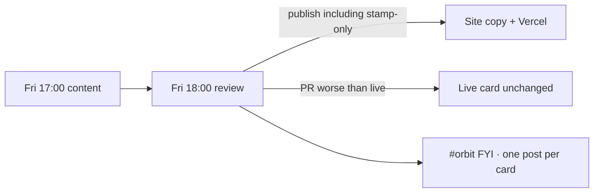

# Field card weekly gate (Orbit)

The review agent is the gate. Slack is FYI after Apply review.

## Normal week

1. Friday 17:00 — content agent runs discover, decides update vs no-change, leaves the weekly PR open.
2. Friday 18:00 — **review agent** publishes (including stamp-only no-change). Keeps the previous card only when the PR would make the live card worse.
3. Slack gets **one laconic FYI per card** (same shape for all three): Review / Considered / Changed / Online + **Check card** button.

## Backup

If the review agent misses, Monday watchdog posts a FYI in #orbit. Finish by re-running the review agent or `gh workflow run "Apply review"`. Do not Slack-Approve. Saturday is not scheduled.

## Cards

| Card | Content repo | Orbit path | Soft URL |
|---|---|---|---|
| Agentic AI | AlexTouvras/agentic-ai-field-card | public/field-card/index.html | /field-card/ |
| Data Analytics | AlexTouvras/data-analytics-field-card | public/analytics-field-card/index.html | /analytics-field-card/ |
| Technology Delivery | AlexTouvras/technology-delivery-field-card | public/delivery-field-card/index.html | /delivery-field-card/ |
| SDLC | *(Orbit-hosted, monthly review)* | public/sdlc-field-card/index.html | /sdlc-field-card/ |
| Credit Risk | *(Orbit-hosted, monthly review)* | public/credit-risk-field-card/index.html | /credit-risk-field-card/ |

Public footers are monthly (`Next: <month>`), not “week of”. The Friday loop above is internal discovery for the three source repos. SDLC and Credit Risk are stamped on Orbit once a month (`.cursor/automations/hosted-field-card-monthly-review.json`).

Signing secret must match across content repos + Orbit (`WEEKLY_WRITE_SECRET` / `CRON_SECRET` / `FIELD_CARD_ACTION_SECRET`).
GitHub token on Orbit must be allowed to read + merge PRs on **all registered** field-card repos (`FIELD_CARD_GITHUB_TOKEN` if the default token is Orbit-only).
