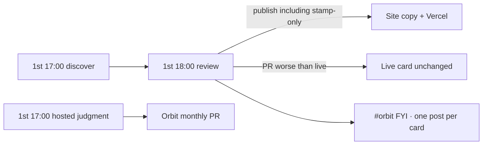

# Field card monthly gate (Orbit)

The review agent is the gate. Slack is FYI after Apply review.

**All six Hub field cards** update monthly: Agentic AI, Data Analytics, Technology Delivery, SDLC, Credit Risk, Data & Visual Storytelling. There is no Friday field-card loop.

## Normal month

1. 1st 17:00 — all six Hub cards plus the Bayesian optimisation method card are judged. Source-repo agents run discover and leave `chore/monthly-refresh-YYYY-MM` open. Hosted SDLC researches the life cycle, then decides update or no-change. Credit Risk is judged on Orbit against the account picture in `field-card-review.md` (the picture is the job). Story and Bayes are judged on Orbit in the same hour against picker and jobs, until a scene rewrite says otherwise. Not stamp-only.
2. 1st 18:00 — **review agent** publishes the three source-repo cards (including stamp-only no-change). Keeps the previous card only when the PR would make the live card worse.
3. Slack gets **one laconic FYI per source-repo card** (same shape for all three): Review / Considered / Changed / Online + **Check card** button.

## Backup

If the review agent misses, the fleet check on the first weekday on or after the 2nd posts a FYI in #orbit. Finish by re-running the review agent or `gh workflow run "Apply review"`. Do not Slack-Approve.

## Cards

| Card | Content repo | Orbit path | Soft URL |
|---|---|---|---|
| Agentic AI | AlexTouvras/agentic-ai-field-card | public/field-card/index.html | /field-card/ |
| Data Analytics | AlexTouvras/data-analytics-field-card | public/analytics-field-card/index.html | /analytics-field-card/ |
| Technology Delivery | AlexTouvras/technology-delivery-field-card | public/delivery-field-card/index.html | /delivery-field-card/ |
| SDLC | *(Orbit-hosted, monthly discovery)* | public/sdlc-field-card/index.html | /sdlc-field-card/ |
| Credit Risk | *(Orbit-hosted, monthly discovery)* | public/credit-risk-field-card/index.html | /credit-risk-field-card/ |
| Data & Visual Storytelling | *(Orbit-hosted, monthly discovery)* | public/story-field-card/index.html | /story-field-card/ |
| Bayesian optimisation | *(Orbit-hosted method — not Hub)* | public/bayes-field-card/index.html | /bayes-field-card/ |

Public footers are monthly (`Next: <month>`), not “week of”. Source-repo discovery uses `chore/monthly-refresh-YYYY-MM`. Hosted SDLC, Credit Risk, Story, and Bayesian optimisation use `chore/monthly-field-cards-YYYY-MM` on Orbit (`.cursor/automations/hosted-field-card-monthly-review.json`). Bayesian optimisation is a method card: it is not a Hub competency.

Signing secret must match across content repos + Orbit (`WEEKLY_WRITE_SECRET` / `CRON_SECRET` / `FIELD_CARD_ACTION_SECRET`).
GitHub token on Orbit must be allowed to read + merge PRs on **all registered** field-card repos (`FIELD_CARD_GITHUB_TOKEN` if the default token is Orbit-only).
