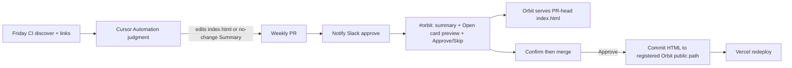

# Field card Slack Approve (Orbit)

Same gate pattern as weekly Writes. Supports multiple cards via src/lib/field-card/registry.ts:

## How a card is researched, created, and kept honest

A field card is a **decision stack**, not a vendor brochure. AI is LLM floor + RAG/AGENT/MCP/A2A. Analytics is ASK/GRAIN/TRUTH/USE. Delivery is INTENT/WINDOW/PROOF/CUTOVER. Each card has a verb line under the H1 and an **Always on** strip (Security, Governance, Observability, Evals, Human Approve) — those are not picker items.

1. **Research.** Open Hub competency copy, CV, and the related Orbit essays. Fetch live docs URLs (never invent them). Name the four layers from how the owner actually decides, not from a framework pitch.
2. **Create.** Standalone `index.html` (print/PDF/LinkedIn) in its own repo. Copy into Orbit `public/<path>/`. Link the Hub competency. Register the repo in `src/lib/field-card/registry.ts` and `sitemap.ts`.
3. **Update (weekly).** Friday CI discovers candidates (no HTML judgment). Friday Cursor Automation must write `## Summary` with **update** or **no-change**. Picker ≤7 rows, swap by constraint. New *job* only if the problem is new; a renamed product is a picker swap.
4. **Evaluate.** `npm run check:links`. Slack **Open card preview**. Human Approve/Skip. Watchdog pings if judgment is silent. Kill switch and anti-patterns stay unless the pattern itself changed.

Do not merge from the agent. Silence is a bug.

| Card | Content repo | Orbit path | Soft URL |
|---|---|---|---|
| Agentic AI | AlexTouvras/agentic-ai-field-card | public/field-card/index.html | /field-card/ |
| Data Analytics | AlexTouvras/data-analytics-field-card | public/analytics-field-card/index.html | /analytics-field-card/ |
| Technology Delivery | AlexTouvras/technology-delivery-field-card | public/delivery-field-card/index.html | /delivery-field-card/ |

## Flow

1. Field-card CI discovers candidates (no HTML judgment)
2. Cursor Automation updates index.html when earned (or records no-change) and runs notify
3. Notify Slack approve posts Block Kit to **#orbit**: summary · **Open card preview** · Approve / Skip
4. Preview: /api/field-card/preview serves PR-head index.html (signed preview token; epo in payload)
5. Approve/Skip: /api/field-card/action — **GET = confirm**, **POST = merge or close**
6. On Approve: merge field-card PR, then commit that repo's index.html to the **registered** Orbit public/... path (Vercel redeploy). Pages updates from the content repo; the site path is this sync.
7. Slack gets a short Approved / Skipped follow-up (links both github.io and alextouvras.com)

Signing secret must match across content repos + Orbit (WEEKLY_WRITE_SECRET / CRON_SECRET / FIELD_CARD_ACTION_SECRET).
GitHub token on Orbit must be allowed to read + merge PRs on **all registered** field-card repos (FIELD_CARD_GITHUB_TOKEN if the default token is Orbit-only), and GITHUB_TOKEN must be able to write Orbit contents (same as weekly Writes / Studio).
