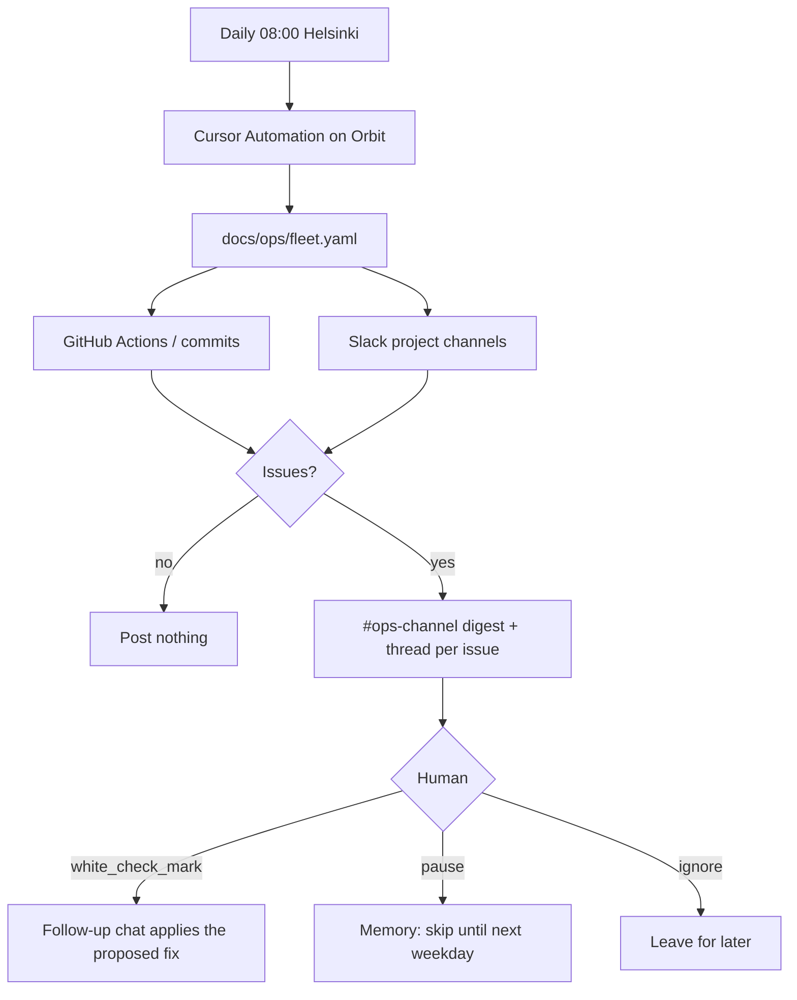

# Fleet ops check

Daily meta-check over projects that run on their own. It does not replace per-project watchdogs (field-card `judgment-watchdog.yml` stays). It notices missed runs, bad output, and stale human gates, then posts a proposed fix to Slack `#ops-channel`. v1 is propose-only: the human approves, snoozes, or leaves it.

Registry: [`docs/ops/fleet.yaml`](../ops/fleet.yaml). Playbook: [`docs/ops/daily-check.md`](../ops/daily-check.md).

**Evidence the cloud agent can actually see:** GitHub (`gh`) and public Slack. It cannot see `~/.cursor/projects`. Do not treat a missing local path as a failed job.

**Not in v1:** auto-fix on emoji, mealplan/ledger missed-run (they are on-demand), harvest G5 (local script is canonical).
