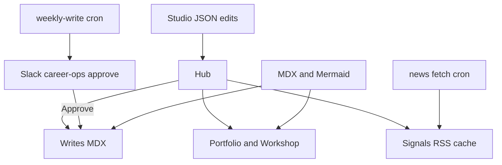

# Orbit content zones

```mermaid
flowchart TB
  Hub[Hub] --> Writes[Writes MDX]
  Hub --> Portfolio[Portfolio and Workshop]
  Hub --> Radar[Signals RSS cache]
  Studio[Studio JSON edits] --> Hub
  Cron[news fetch cron] --> Radar
  Weekly[weekly-write cron] --> Slack[Slack career-ops approve]
  Slack -->|Approve| Writes
  MDX[MDX and Mermaid] --> Writes
  MDX --> Portfolio
```
