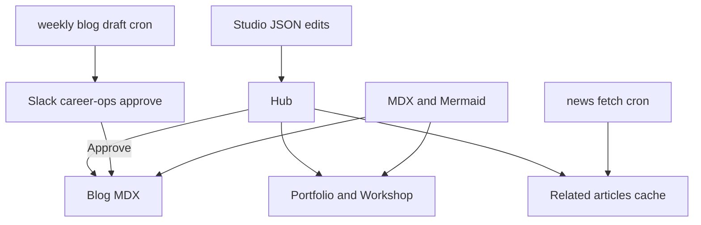

# Orbit content zones

```mermaid
flowchart TB
  Hub[Hub] --> Blog[Blog MDX]
  Hub --> Portfolio[Portfolio and Workshop]
  Hub --> Feed[Related articles cache]
  Studio[Studio JSON edits] --> Hub
  Cron[news fetch cron] --> Feed
  Weekly[weekly blog draft cron] --> Slack[Slack career-ops approve]
  Slack -->|Approve| Blog
  MDX[MDX and Mermaid] --> Blog
  MDX --> Portfolio
```
