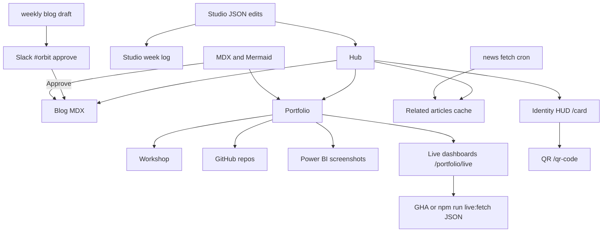

# Orbit content zones

```mermaid
flowchart TB
  Hub[Hub] --> Blog[Blog MDX]
  Hub --> Portfolio[Portfolio]
  Portfolio --> Workshop[Workshop]
  Portfolio --> Github[GitHub repos]
  Portfolio --> PowerBI[Power BI screenshots]
  Portfolio --> Live[Live dashboards /portfolio/live]
  Live --> Snapshots[GHA or npm run live:fetch JSON]
  Hub --> Feed[Related articles cache]
  Hub --> Card[Identity HUD /card]
  Card --> QrPage[QR /qr-code]
  Studio[Studio JSON edits] --> Hub
  Studio --> WeekLog[Studio week log]
  Cron[news fetch cron] --> Feed
  Weekly[weekly blog draft] --> Slack[Slack #orbit approve]
  Slack -->|Approve| Blog
  MDX[MDX and Mermaid] --> Blog
  MDX --> Portfolio
```
