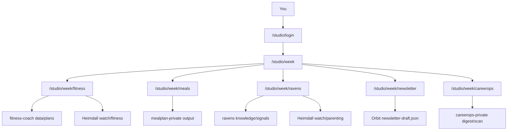

# Studio week log (private)

Owner-only week hub of personal-ops outputs. Not in public nav. Auth is Studio session (GitHub allowlist primary; password emergency; optional `STUDIO_DEV_OPEN` on localhost).

## Routes

| Path | Purpose |
|------|---------|
| `/studio/week` | Hub with status chips |
| `/studio/week/fitness` | Plan + **Technique** expands on matching lifts |
| `/studio/week/meals` | Meal plan |
| `/studio/week/ravens` | Findings + stage-matched parenting **Watch** |
| `/studio/week/newsletter` | Digest draft |
| `/studio/week/careerops` | Scan / apply queues |

Heimdall is not a separate topic. Clips attach inline via `HeimdallEmbed` when `ravens/watch/{domain}/{slug}.md` matches.

## Auth

- Primary: GitHub OAuth (`GITHUB_CLIENT_ID` / `GITHUB_CLIENT_SECRET`), allowlist `STUDIO_GITHUB_ALLOWLIST`.
- Session cookie `orbit_studio`: 90-day TTL, sliding refresh via `/api/studio/session`.
- Emergency password: `STUDIO_PASSWORD` (collapsed on login).
- Local review: `STUDIO_DEV_OPEN=1` skips the login gate in development only.
