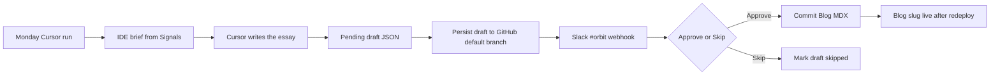

# Weekly blog draft pipeline

Automated draft from Related articles + workshop projects → Slack approval in `#orbit` → publish to Blog.

**Slack access:** the notify payload includes the **full essay** in chunked Block Kit sections (not a teaser). Browser preview/Approve still need `data/weekly-write-draft.json` on the **default branch** (`GITHUB_TOKEN` via `persistWeeklyDraftCli`). A feature-branch-only commit is not enough — Vercel reads the default branch.

The pipeline writes `data/weekly-write-ide-brief.md` and waits. Generate the essay in Cursor (`docs/essay-voice.md`), then `npm run weekly:notify-draft`. Confirm `"githubSynced": true` in the CLI output. `--allow-local-fallback` can draft with Ollama, OpenAI, or a template. That flag is explicit.
