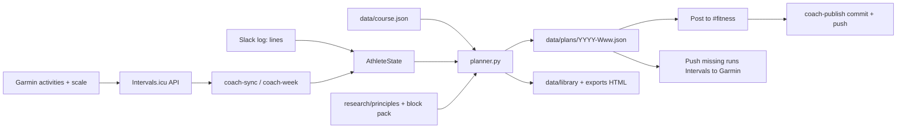
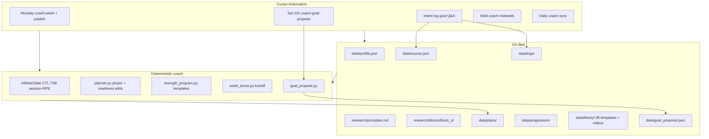
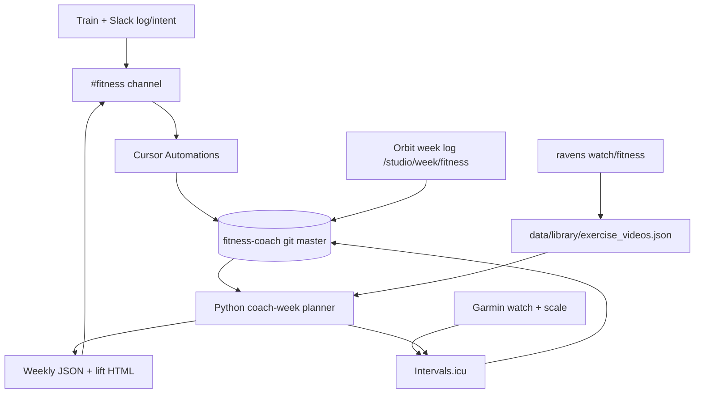

{/* AUTO-GENERATED from fitness/docs/architecture/ — edit source there, then npm run arch:sync-all */}

Canonical architecture for **fitness**. Linked from the project essay; not listed in Blog.

## What it solves

Training apps are good at logging. They are weak at **arguing with you on Sunday** when CTL says cut quality but ego wants a hero week — and weaker still when running and lifting share the same body.

**Pain**

- Re-explaining constraints every week in chat scrollback
- Hard run days stacked on heavy leg days because the calendar looked empty
- Garmin plans that never reach the coach (and vice versa)
- No durable receipt when the plan changes for readiness

**Job to be done**

Every Sunday, deliver a phone-readable week in Slack `#fitness`: Mon/Wed/Fri runs (Intervals → Garmin), Tue/Thu lifts (coach-owned templates), and a **Why this week** built from Intervals form (CTL/ATL/TSB), Slack RPE logs, and block research. Mid-week: `log:` for sessions, `intent:` for path tweaks, `goal:` for mesocycle swaps.

**Out of scope**

- Medical diagnosis or injury treatment (sharp pain → clinician)
- Broker-style automation of the athlete (human still trains)
- Reading Garmin-native planned workouts from the watch (coach pushes Intervals → Garmin instead)
- A native mobile app (Slack is the UI)

**Approach**

Git `data/*` is the database. Python planner encodes readiness rules. Cursor Automations run Monday plan, daily sync, and chat routing. Intervals.icu is the Garmin hub. Research packs under `research/blocks/<id>/` swap per mesocycle; `research/principles.md` stays durable.

## Weekly pipeline

Monday 07:15 Athens: Automation hard-resets to `origin/master`, runs `coach-week`, posts Slack markdown, then **`coach-publish`** commits and pushes `data/` — Slack alone is not done. Daily 07:00 `coach-sync` runs first.

**Daily 07:00** — `coach-sync --with-state` refreshes `data/intervals/summary.json`, `data/progression/` (incl. Codex), and this week's HUD. No session rewrite, no Garmin.

**Saturday 21:00** — `coach-goal-propose` posts when the **effective** mesocycle end is today or past (race date if set, otherwise `start_date + planned_weeks`). Quiet if there is already a pending marker. Runs Saturday evening so there is Sunday to `goal: approve` before the Monday 07:15 week plan. Never mutates `goals.primary`.

**Wednesday 08:00 (optional)** — `coach-midweek` may cut quality if readiness flipped after Monday.

**Chat Automation** — every `#fitness` message: hard-reset to `master`, read latest `data/plans/*.json`, route `intent:` / `log:` / `goal:` / Q&A.

**Runtime notes**

- Cloud agents must `git reset --hard origin/master` before speaking or they invent stale weeks
- Monday `coach-week` targets **this** Monday (`_week_ahead_start`); a leftover Sunday run still targets the upcoming Monday
- If Intervals already has a run on Mon/Wed/Fri, reuse it; otherwise generate and push. Also upsert next Monday's easy run (Garmin ~7-day window)
- Kickoff block adds quote + Heimdall motivate clip + Spotify playlists (`week_boost.py`)

## Data vs agent

Mechanical rules stay in Python + git. Judgment and natural-language routing stay with the Cursor Automation.

| Concern | Owner | Why |
|---------|--------|-----|
| Primary goal, block_id, lift week | `data/profile.json` | Mesocycle spine |
| Path tweaks (time, race effort, lift style) | `data/course.json` via `intent:` or Orbit Studio Apply | Rewrites this week without a new block |
| Parse `intent:` message, commit, push | Automation | Git write + ack in Slack |
| Orbit Studio Apply (production) | `repository_dispatch` `studio-apply-course` | GHA runs `coach-course`, commits `data/` |
| CTL/ATL/TSB, wellness, calendar | Intervals sync → summary | Running form |
| Session RPE, sore/travel hints | Slack `log:` → `data/logs/` | Strength PMC proxy |
| cut_quality, ease_lower_lift, phase | `athlete_state.py` | Readiness flags the planner must obey |
| Mon/Wed/Fri run skeleton, taper/sharpen | `planner.py` + block pack | Calendar-dumb phases |
| Tue/Thu lift prescriptions | `data/library/coach_wN_*.json` | Coach-owned, no paid PDFs |
| Form-check YouTube links | `exercise_videos.json` (Heimdall snapshot) | Joined at HTML/Slack render |
| Kickoff quote / motivate / playlists | `week_boost.json` + ravens | Human tone on Sunday |
| Propose next mesocycle when event date ends | `coach-goal-propose` + Sat 21:00 Automation | Effective end = race date or planned duration; marker file only; human must approve before `goals.primary` commit |
| Propose `goal:` mesocycle swap (chat) | Automation | Human must approve before commit |

**Slack prefix routing (order matters)**

1. `intent:` / `course:` / `path:` → `coach-intent` → course + regenerate week
   Orbit Studio Apply on production → `repository_dispatch` `studio-apply-course` (same CLI)
2. `log:` → `CoachService.log_result` → RPE debt / strength form
3. `goal:` → propose profile + block pack only (no commit until approved). `goal: approve …` against a pending `data/goal_proposal.json` is the follow-up yes.
4. Else → answer from latest plan + principles (short)

## System overview

Components:

- **`fitness-coach` repo** — profile, course, plans, logs, progression, lift library on `master`
- **`coach-week` CLI** — sync, AthleteState, plan generation, Slack markdown, optional Intervals calendar push
- **Cursor Automations** — Monday plan + publish, daily sync, chat router (Slack trigger)
- **Intervals.icu** — activities, wellness, fitness chart (CTL/ATL/TSB), calendar events to Garmin
- **Slack `#fitness`** — Sunday delivery, session logs, path intents, Q&A
- **Heimdall (ravens)** — form-check and motivate clips; snapshot in repo for cloud renders
- **Orbit Studio** — owner week log embeds Heimdall Technique on lifts (private lane)

Repo: [github.com/AlexTouvras/fitness-coach](https://github.com/AlexTouvras/fitness-coach)
