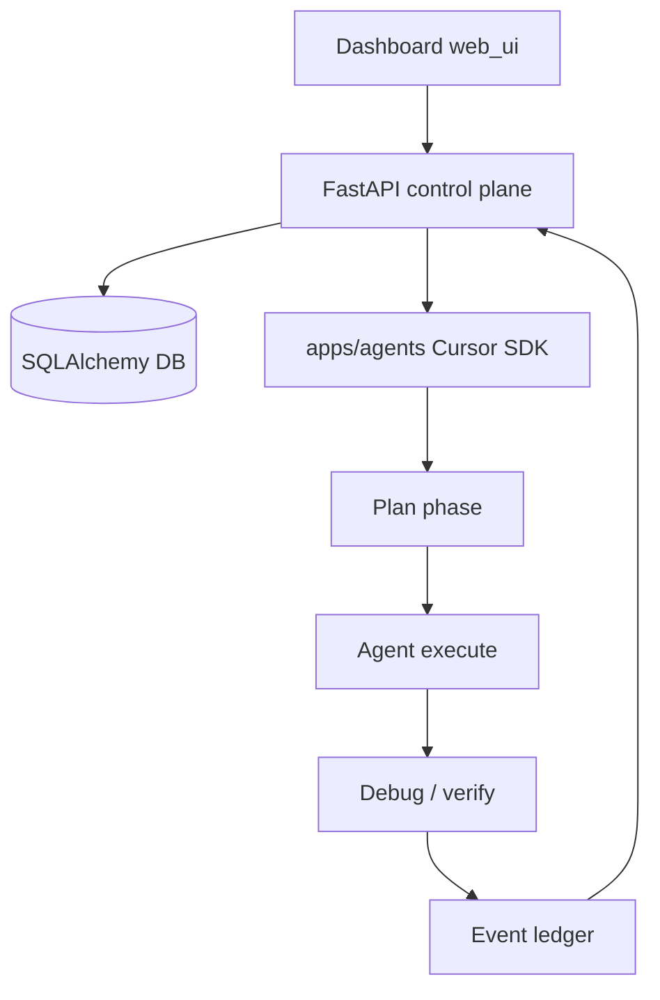

{/* AUTO-GENERATED from JARVIS/docs/architecture/ — edit source there, then npm run arch:sync-all */}

Canonical architecture for **JARVIS**. Linked from the project essay; not listed in Writes.

## ProjectHelm control plane

