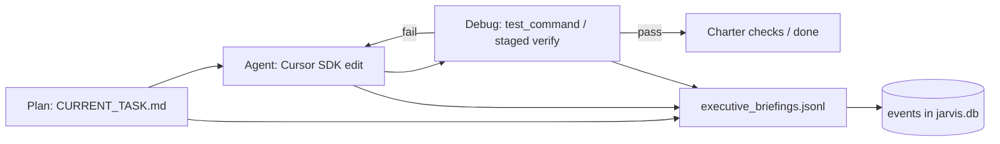
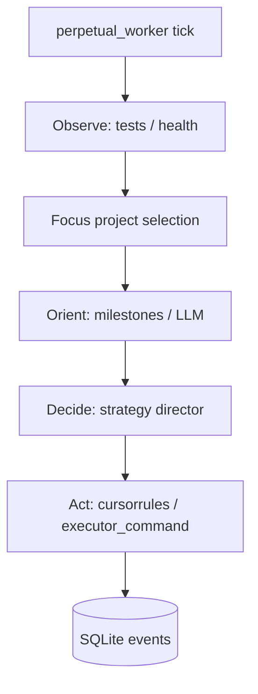
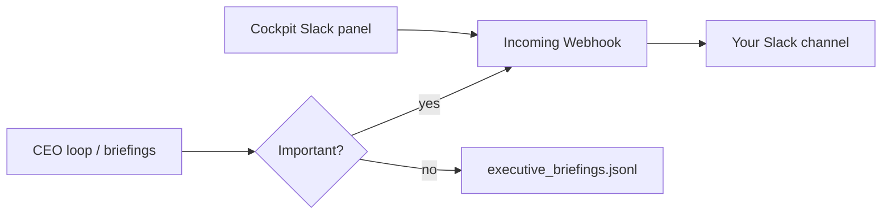
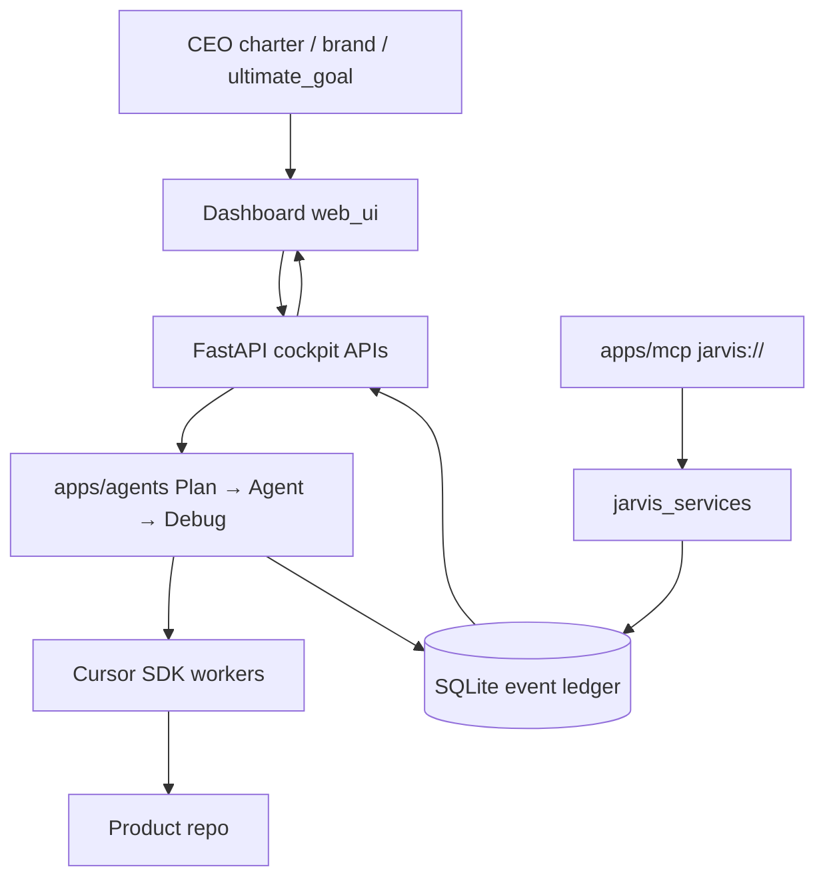

{/* Source of truth: JARVIS/docs/architecture/ — retired; re-sync with npm run arch:sync-all if diagrams change */}

> **Retired 2026-07-22.** ProjectHelm is no longer the portfolio foreman. Do not start the CEO loop or OODA autopilot. Work in product repos with Cursor rules + skills. See `JARVIS/RETIRED.md`.

Canonical architecture for **JARVIS** (historical). Linked from the project essay; not listed in Blog.

## Plan → Agent → Debug (CEO loop)

> **RETIRED.** Do not start. Former default path (cockpit / `py -3 -m apps.agents`).

| Phase | Intent |
|-------|--------|
| Plan | Scoped breakdown + done criteria before edits |
| Agent | Bounded job for a child agent (not the whole chat) |
| Debug | Named verification; retry Agent on failure |

State: `io/logs/agent_loop/{project_id}.json`. Briefings: `io/logs/executive_briefings.jsonl`.

## Legacy OODA autopilot

> **Also retired.** Entry points refuse to start. Diagrams below are historical only.

Cockpit label: **Legacy OODA Autopilot**.

## Away-from-IDE notifications

Webhook from `SLACK_WEBHOOK_URL` in `.env` or cockpit-saved `io/logs/runtime_secrets.json`. Toggle: `slack_enabled` in `runtime_user_settings.json`.

## ProjectHelm control plane

Local foreman for multi-agent coding: you set the charter / north star; JARVIS runs **Plan → Agent → Debug** via the Cursor SDK, appends outcomes to an event ledger, and exposes status + kill switches in the web cockpit.

Merge stays human. Fully autonomous shipping is out of scope.
