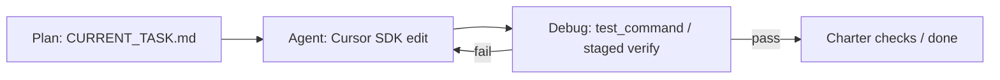
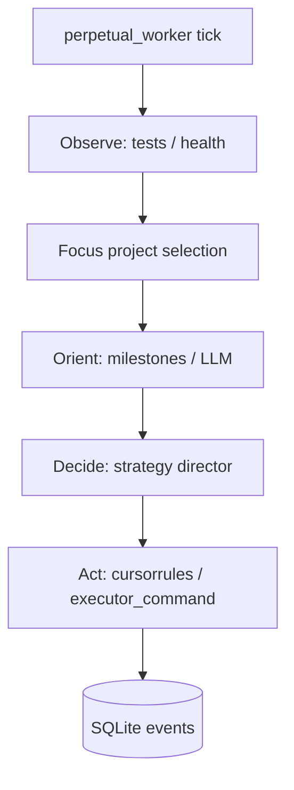
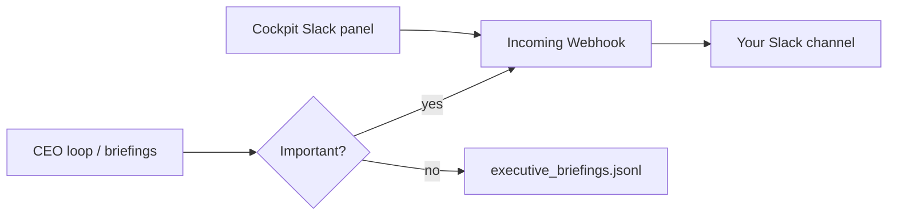
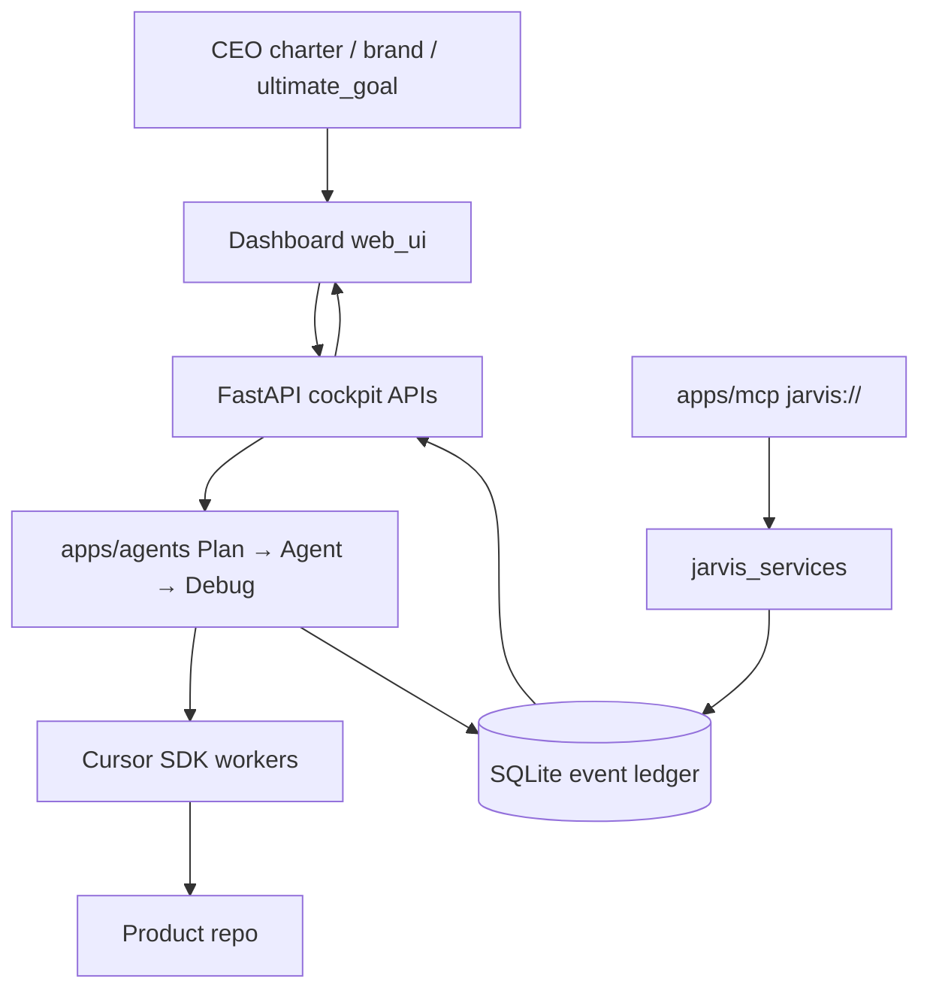

{/* AUTO-GENERATED from JARVIS/docs/architecture/ — edit source there, then npm run arch:sync-all */}

Canonical architecture for **JARVIS**. Linked from the project essay; not listed in Blog.

## Plan → Agent → Debug (CEO loop)

> **RETIRED 2026-07-22.** Do not start. See `RETIRED.md`. Replaced by Cursor rules + skills in each product repo.

Former default product path (cockpit / `py -3 -m apps.agents`). Entry points now refuse to run.

Archaeology only. State was `io/logs/agent_loop/{project_id}.json`.

## Legacy OODA autopilot

`perpetual_worker.py` Observe → Orient → Decide → Act remains available for milestone / strategy experiments. It is **not** the CEO default. Prefer Plan → Agent → Debug for product work; do not run both loops as primary drivers on the same project.

Cockpit label: **Legacy OODA Autopilot**.

## Away-from-IDE notifications

Webhook from `SLACK_WEBHOOK_URL` in `.env` or cockpit-saved `io/logs/runtime_secrets.json`. Toggle: `slack_enabled` in `runtime_user_settings.json`.

**Channel:** use a dedicated **`#jarvis`** Incoming Webhook (do not reuse the Orbit `#career-ops` weekly webhook). Create `#jarvis` in Slack, then add a webhook pointed at that channel.

## ProjectHelm control plane

Local foreman for multi-agent coding: you set the charter / north star; JARVIS runs **Plan → Agent → Debug** via the Cursor SDK, appends outcomes to an event ledger, and exposes status + kill switches in the web cockpit.

Merge stays human. Fully autonomous shipping is out of scope.
