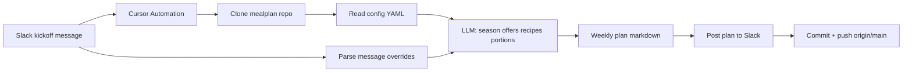
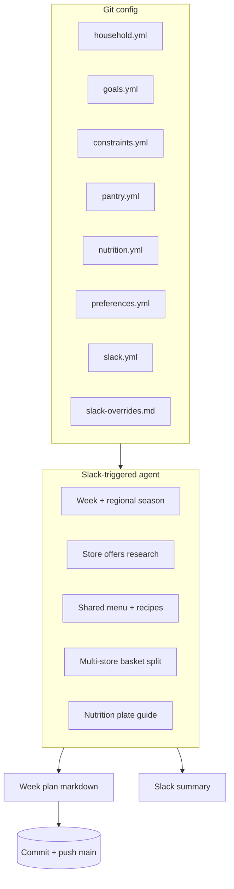
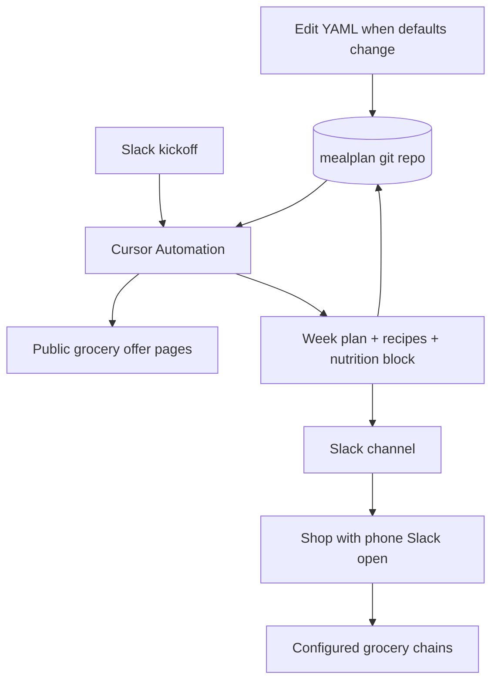

{/* AUTO-GENERATED from mealplan/docs/architecture/ — edit source there, then npm run arch:sync-all */}

Canonical architecture for **mealplan**. Linked from the project essay; not listed in Blog.

## What it solves

Chat is fine for a one-off menu. It is a bad home for a recurring planning loop: rules live in the thread, the shopping list disappears into scrollback, and next week you re-explain constraints the model already knew.

**Pain**

- Re-stating diet rules, stores, and goals every time you ask for a plan
- Losing the list when you need it on the phone in the aisle
- Weeks that ignore seasonality (and price)
- No versioned artifact when a plan goes sideways

**Job to be done**

On demand from Slack, produce a full-week meal plan: recipe links, science-backed plate guidance, a multi-store grocery split aimed at lower spend, and a phone-readable channel post. The kickoff message can override week dates, ingredients, and nutrition modes for that run.

**Out of scope**

- Online checkout / payment
- Separate dinner menus per person (one shared menu; portions can differ)
- Ignoring hard diet or cadence rules via chat overrides
- File attachments via Automations Slack (text + optional repo link only)

**Approach**

Durable facts in YAML on a git repo. Weekly judgment in a Cursor Automation. Kickoff and delivery in the same Slack channel. Config holds the spine; the agent handles soft tradeoffs (season, offers, recipes, basket split).

## Weekly pipeline

A Slack message in the configured channel that matches the filter starts the run. The agent checks out the repo, applies message overrides on top of YAML, researches season and store offers when it can, writes the week file, posts back to Slack, then commits and pushes the plan to `main`.

**Runtime notes**

- Laptop can be off; work runs on Cursor cloud agents
- Slack *triggers* require a public channel
- Overrides (week start, include ingredient, goal mode, …) are run-only unless the message asks to save to config
- After Slack, the week file (`output/YYYY-WNN-plan.md`) is required on `origin/main` — no PR
- Price totals are planning estimates until confirmed in-store
- Hard rules in config always win over Slack text

## Config vs agent

Stable judgment stays in files. Weekly judgment and Slack overrides stay with the model.

| Concern | Owner | Why |
|---------|--------|-----|
| People, diet, location, preferred stores | `household.yml` | Must not invent |
| Goal modes (cut / lean / maintain / bulk / …) | `goals.yml` (+ Slack override) | Defaults in git; one-run tweaks in the kickoff |
| Hard diet cadence, allergies, time caps | `constraints.yml` | Hard stops |
| Staples already at home | `pantry.yml` | Cut duplicate buys |
| Macro / protein reference targets | `nutrition.yml` | Cited in every Slack post |
| Kickoff phrase grammar | `slack-overrides.md` | What natural language can change |
| Season, offers, recipe URLs, basket split | Agent | Soft tradeoffs; needs current context |

**Shared menu rule:** one dinner track for the household. Modes adjust portions and snacks, not parallel kitchens.

**Slack override examples:** week starts DATE; one meal with INGREDIENT; change a person’s mode; prefer a protein for the week’s fish/legume slot; soft budget; save to config.

## System overview

Components:

- **Git repo** — household config, style notes, weekly plan artifacts on `main`
- **Cursor Automation** — Slack message trigger, repo checkout, prompt, Send to Slack, then commit/push the week file (no PR)
- **Slack channel** — kickoff + delivery surface
- **Grocery web** — best-effort offers and prices; not a contractual shelf API
