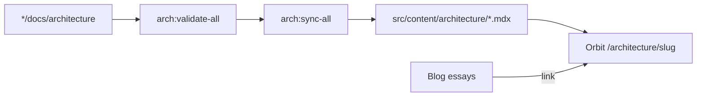
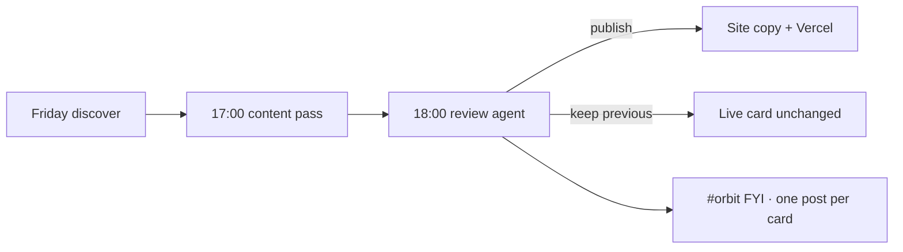
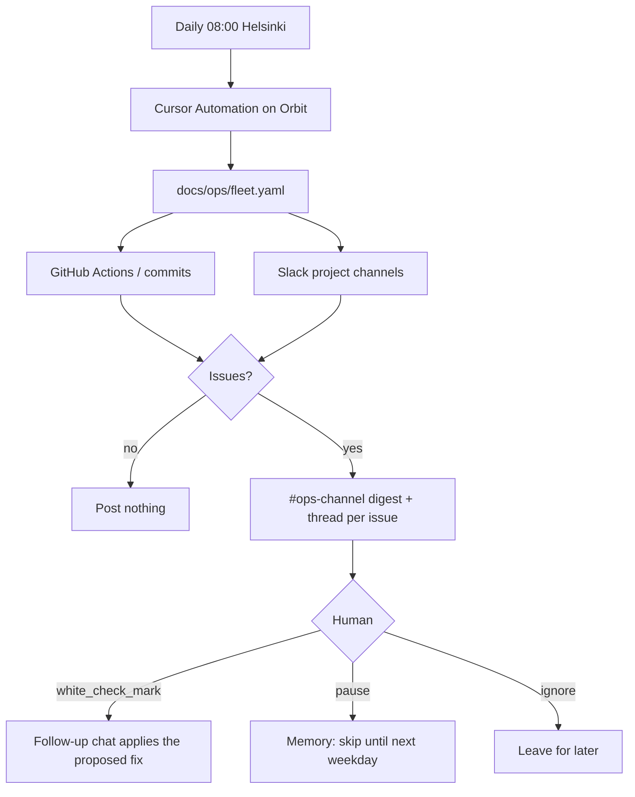
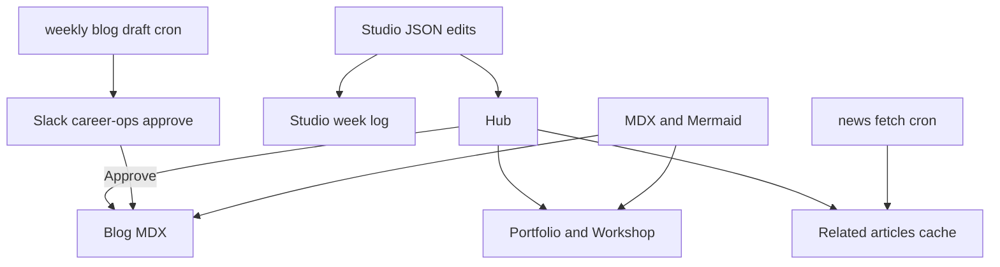
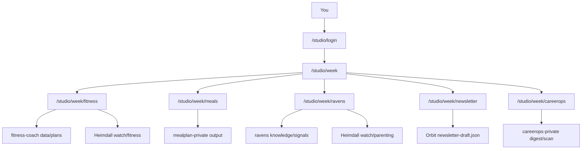
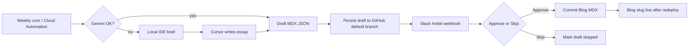

{/* AUTO-GENERATED from website/docs/architecture/ — edit source there, then npm run arch:sync-all */}

Canonical architecture for **website**. Linked from the project essay; not listed in Blog.

## Architecture sync pipeline



## Field card weekly gate (Orbit)

The review agent is the gate. You do not Approve in Slack unless that agent misses.

## Normal week

1. Friday ~15:00 — CI opens a discovery PR (no Slack ping).
2. Friday 17:00 — content agent may edit the card; leaves the PR open.
3. Friday 18:00 — **review agent** compares proposed HTML to live, then publishes or keeps the previous card.
4. Slack gets **one laconic FYI per card** (same shape for all three): Review / Considered / Changed / Online + **Check card** button.

## Backup

If the review agent misses, Saturday/Monday watchdog can still post **Open the new card / Approve / Decline**.

## Cards

| Card | Content repo | Orbit path | Soft URL |
|---|---|---|---|
| Agentic AI | AlexTouvras/agentic-ai-field-card | public/field-card/index.html | /field-card/ |
| Data Analytics | AlexTouvras/data-analytics-field-card | public/analytics-field-card/index.html | /analytics-field-card/ |
| Technology Delivery | AlexTouvras/technology-delivery-field-card | public/delivery-field-card/index.html | /delivery-field-card/ |



Signing secret must match across content repos + Orbit (`WEEKLY_WRITE_SECRET` / `CRON_SECRET` / `FIELD_CARD_ACTION_SECRET`).
GitHub token on Orbit must be allowed to read + merge PRs on **all registered** field-card repos (`FIELD_CARD_GITHUB_TOKEN` if the default token is Orbit-only).

## Field card review (Orbit)

A second Cursor agent is the weekly gate. It does not write the card. It compares the proposed `index.html` to the live one, then **publishes** or **keeps the previous card**.

Friday 17:00 local drafts the PR. This agent runs Friday 18:00 local (`0 15 * * 5` UTC).

## Cards

| Card | Repo | Live |
|---|---|---|
| Agentic AI | `AlexTouvras/agentic-ai-field-card` | https://alextouvras.com/field-card/ |
| Data Analytics | `AlexTouvras/data-analytics-field-card` | https://alextouvras.com/analytics-field-card/ |
| Technology Delivery | `AlexTouvras/technology-delivery-field-card` | https://alextouvras.com/delivery-field-card/ |

## For each open weekly PR (`chore/weekly-refresh-*`)

1. Fetch `index.html` on the PR head and on `main`.
2. Read the PR `## Summary` and `data/link-report.json` on the PR head if present.
3. Check the card-specific spine below. Never invent docs URLs.
4. Decide **approve** (publish) or **decline** (keep the live card).
5. Apply — do not merge with `gh pr merge`. Run:

```bash
gh workflow run "Apply review" --repo <repo> -f pr_number=<N> -f decision=approve -f note="<one laconic sentence: what changed or why no-change>"
## or decision=decline
```

6. **One Slack post per card** (never a multi-card dump). Prefer Orbit's FYI from Apply review. Only post yourself when Apply review failed or Orbit did not notify.

### Laconic #orbit FYI (identical shape for all three cards)

```
*<Card label>*
Review: published | kept previous | blocked
Considered: <short list or “none earned entry”>
Changed: <one line — what entered / stamp-only / why declined>
Online: yes · <detail>   OR   no · previous still live
[Check card]   ← button to live site URL (or Open PR when blocked)
```

Rules for that post:
- One card = one message. Same fields every time (always include Considered).
- Keep each line short. No bullet walls. No discovery stats dumps.
- `Considered` = what you weighed for the picker/table. `Changed` = what actually shipped (or why not).
- `Online: yes` only when the newest reviewed version is (or is about to be) the live site card.
- Button is a real Slack **actions** button labeled **Check card** (or **Open PR** when blocked).

Backup gate (review agent missed) uses the same laconic body shape with three Block Kit buttons: **Open the new card** · **Approve** · **Decline**.

If a card has no open weekly PR, skip it. Do not open a new PR. Do not edit HTML.

## Publish when

- The proposed HTML is a real improvement: picker swap by constraint, docs URL fix, or a new *job* in the decision table.
- Or the HTML is unchanged aside from the weekly stamp, and the spine is intact (reviewed, no worse).
- Picker is still ≤7 rows.
- Link check is clean on URLs this PR touched.
- Always-on strip, kill switch, and anti-patterns are still there.

## Keep the previous card when

- The PR is discovery noise that would make the public card worse (brochure language, extra picker rows, invented URLs).
- The author pass never wrote a `## Summary` and the HTML is not a clear fix.
- Link check failed on URLs the PR touched.
- You cannot tell what changed.

When keeping previous, decline. Do not try to fix the HTML in this run.

## Spines (do not break)

- **AI:** RAG → AGENT → MCP → A2A, thin LLM floor, verb line, Always on strip. Not a vendor wall.
- **Analytics:** ASK → GRAIN → TRUTH → USE. Not a Fabric/Power BI brochure.
- **Delivery:** INTENT → WINDOW → PROOF → CUTOVER. Not Scrum/SAFe/Azure DevOps brochure.

## Backup

If this agent misses, Saturday/Monday watchdog can still post Open / Approve / Decline in Slack so a person can finish the week.

## Fleet ops check

Daily meta-check over projects that run on their own. It does not replace per-project watchdogs (field-card `judgment-watchdog.yml` stays). It notices missed runs, bad output, and stale human gates, then posts a proposed fix to Slack `#ops-channel`. v1 is propose-only: the human approves, snoozes, or leaves it.

Registry: [`docs/ops/fleet.yaml`](../ops/fleet.yaml). Playbook: [`docs/ops/daily-check.md`](../ops/daily-check.md).



**Evidence the cloud agent can actually see:** GitHub (`gh`) and public Slack. It cannot see `~/.cursor/projects`. Do not treat a missing local path as a failed job.

**Not in v1:** auto-fix on emoji, mealplan/ledger missed-run (they are on-demand), harvest G5 (local script is canonical).

## Orbit content zones



## Studio week log (private)

Owner-only week hub of personal-ops outputs. Not in public nav. Auth is Studio session (GitHub allowlist primary; password emergency; optional `STUDIO_DEV_OPEN` on localhost).



## Routes

| Path | Purpose |
|------|---------|
| `/studio/week` | Hub with status chips |
| `/studio/week/fitness` | Plan + **Technique** expands on matching lifts |
| `/studio/week/meals` | Meal plan |
| `/studio/week/ravens` | Findings + stage-matched parenting **Watch** |
| `/studio/week/newsletter` | Digest draft |
| `/studio/week/careerops` | Scan / apply queues |

Heimdall is not a separate topic. Clips attach inline via `HeimdallEmbed` when `ravens/watch/{domain}/{slug}.md` matches.

## Auth

- Primary: GitHub OAuth (`GITHUB_CLIENT_ID` / `GITHUB_CLIENT_SECRET`), allowlist `STUDIO_GITHUB_ALLOWLIST`.
- Session cookie `orbit_studio`: 90-day TTL, sliding refresh via `/api/studio/session`.
- Emergency password: `STUDIO_PASSWORD` (collapsed on login).
- Local review: `STUDIO_DEV_OPEN=1` skips the login gate in development only.

## Weekly blog draft pipeline

Automated draft from Related articles + workshop projects → Slack approval in `#orbit` → publish to Blog.



**Slack access:** the notify payload includes the **full essay** in chunked Block Kit sections (not a teaser). Browser preview/Approve still need `data/weekly-write-draft.json` on the **default branch** (`GITHUB_TOKEN` via `persistWeeklyDraftCli`). A feature-branch-only commit is not enough — Vercel reads the default branch.

When Gemini is configured but unavailable (rate limit etc.), the pipeline writes `data/weekly-write-ide-brief.md` and waits. Generate the essay in Cursor, then `npm run weekly:notify-draft` to continue Slack approve. Confirm `"githubSynced": true` in the CLI output.
