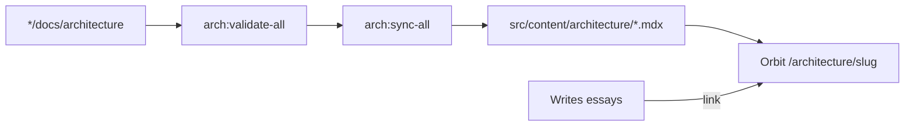
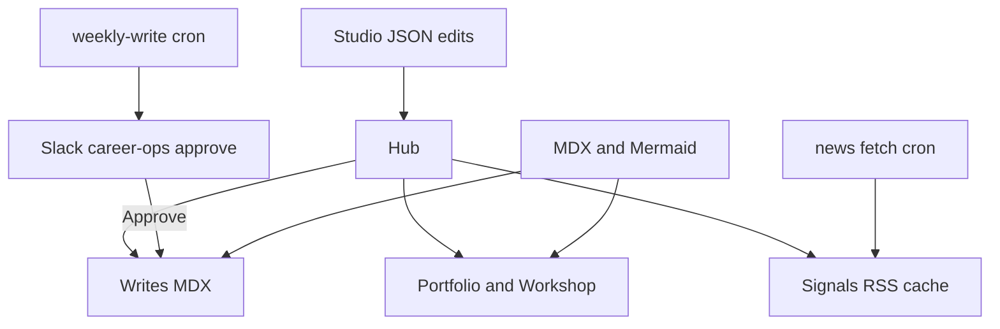
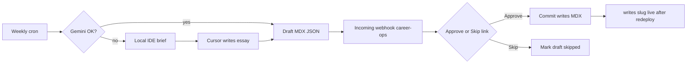

{/* AUTO-GENERATED from website/docs/architecture/ — edit source there, then npm run arch:sync-all */}

Canonical architecture for **website**. Linked from the project essay; not listed in Writes.

## Architecture sync pipeline

## Orbit content zones

## Weekly Write pipeline

Automated draft from Signals + workshop projects → Slack approval in career-ops → publish to Writes.

When Gemini is configured but unavailable (rate limit etc.), the pipeline writes `data/weekly-write-ide-brief.md` and waits. Generate the essay in Cursor, then `npm run weekly:notify-draft` to continue Slack approve.
