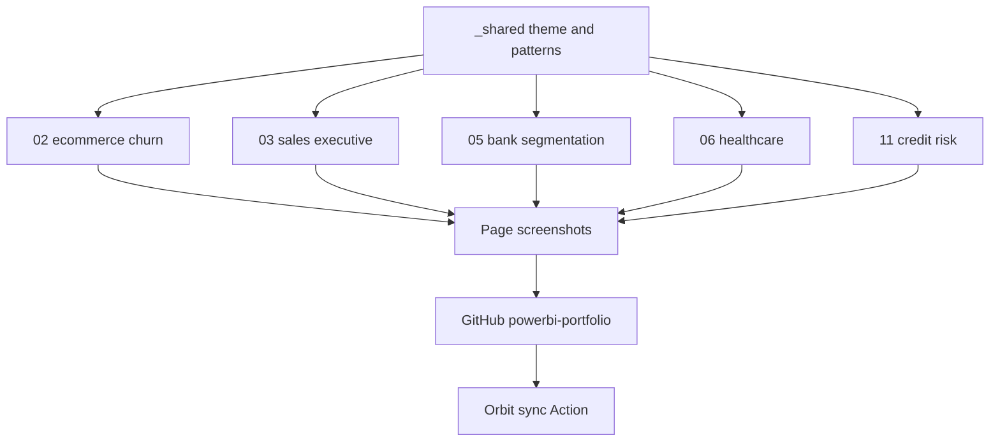
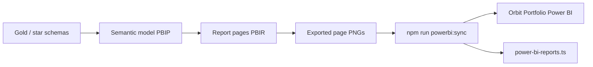
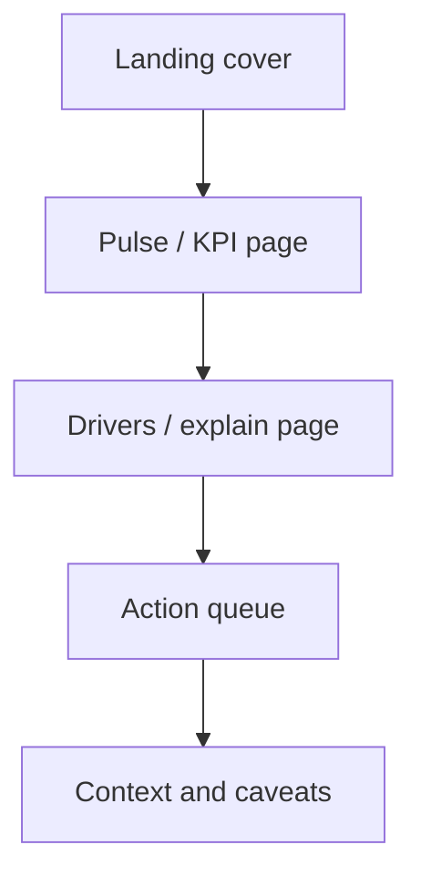

{/* AUTO-GENERATED from PowerBI/docs/architecture/ — edit source there, then npm run arch:sync-all */}

Canonical architecture for **PowerBI**. Linked from the project essay; not listed in Blog.

## Nordic Boardroom stack

Shared design system and build path across featured Nordic Boardroom reports.

## Power BI portfolio pipeline

How reports move from local PBIP work to the Orbit Portfolio showcase.

## Report page contract

Each portfolio report follows the same reader path so a hiring manager can scan without guessing where to look.

