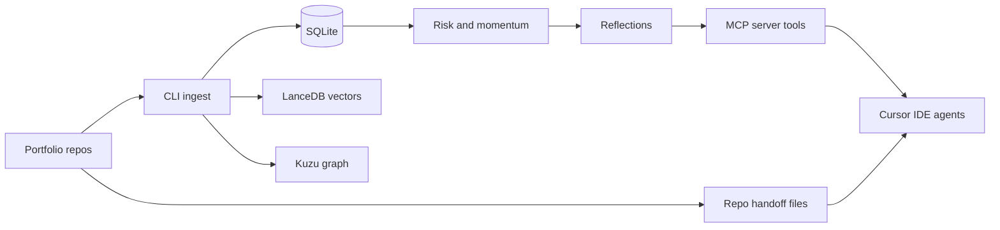

{/* AUTO-GENERATED from Memory/docs/architecture/ — edit source there, then npm run arch:sync-all */}

Canonical architecture for **Memory**. Linked from the project essay; not listed in Blog.

## ProjectBrain — system overview

Personal project intelligence for a multi-repo Cursor portfolio. Git remains source of truth per repo; ProjectBrain ingests charters, decisions, and reflections into a local store agents query through MCP.

## Ingest and query loop

## Runtime boundaries

| Runtime | May use ProjectBrain MCP? | Memory source |
| --- | --- | --- |
| Cursor IDE (local) | Yes | MCP + repo handoff files |
| Cursor Automations (cloud) | No | Target repo `.state/` / playbooks on GitHub only |

## Milestone 4 capabilities

- Installer, `doctor`, backup/restore, encrypted export sync
- Scoring (success, risk, momentum, value, fulfillment, technical debt)
- Playbook extraction from winner projects; `setup_new_project` one-shot kit
- Semantic search (LanceDB), graph traverse (Kùzu), portfolio summary
- Evolution scout + adoption eval gate; monthly digest

## Data location

Default: `%USERPROFILE%\.projectbrain\` or repo-local `.projectbrain/` when `PROJECTBRAIN_DATA_DIR` is set.
