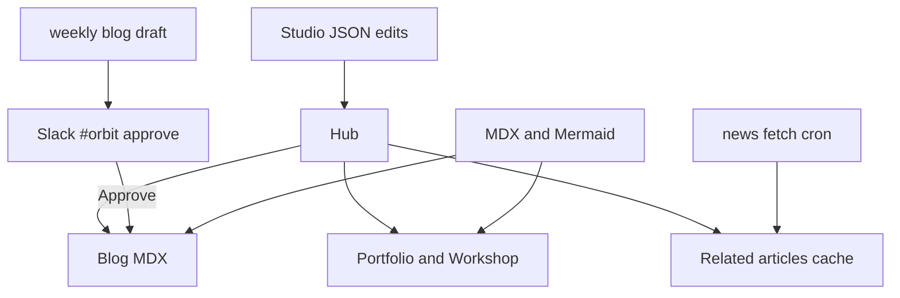
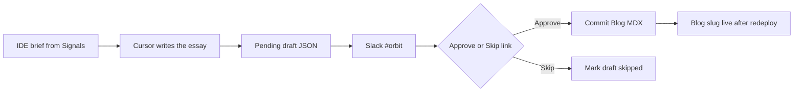
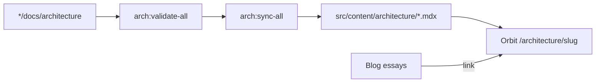

## The question

If this site has to still make sense in five years, what do I refuse to outsource: the content, the deploy path, or the story of what I ship?

I tried the usual exits first. Medium owns distribution until it doesn't. LinkedIn posts age into sludge. Template portfolios look finished on day one and then rot because updating them means fighting the theme. I wanted something closer to an ops console than a brochure: versioned files, a place for unfinished work, and a feed I curate instead of algorithm soup.

## What Orbit is for

Orbit is my public headquarters. Not a blog with a fancy shell. The Hub has to answer hiring-manager questions fast: what I do, what I've built, and how to reach me. Everything else hangs off that.

Public lanes today:

- **Blog** — one question per article, MDX in git.
- **Portfolio** — workshop projects, GitHub, and the Power BI page viewer.
- **Related articles** — cached RSS across AI, Data, Analytics, and Delivery (category-balanced so AI feeds do not drown the quieter lanes).

Private lanes matter as much as the public ones. `/studio` edits profile and published projects without a CMS. A weekly blog-draft cron can pull from that RSS cache + workshop state, then ask me to Approve in Slack before anything hits git.

I used to route multi-agent coding through a separate local control plane (ProjectHelm / JARVIS). That path is retired. The operating system is now Cursor rules + skills inside each product repo, with Orbit as the public surface.

## Why the name

The starfield is decoration. The name is the model.

An orbit is a stable relationship around a center. The center here is gravity: the processes, building blocks, and operating habits that keep the work from drifting. Owned files in git. Diagrams that stay with the code. Automation with a human Approve gate. A commitment to evolve how I build instead of redesigning the homepage every quarter.

What orbits that center are the things you actually see: products, Blog essays, Related signals, workshop projects, field cards, architecture pages. They move on different cadences. They stay in range because the process in the middle holds.

If the gravity weakens (no gate, no source of truth, no honest update loop), the public surface drifts into brochure. That is what "headquarters" means in the title: not the biggest site on the internet, but a place where how I work stays strong enough to hold the work I ship.

## Content zones (how the pieces connect)

Studio writes JSON under `data/`. The project scanner only runs on my machine because it walks local Cursor folders; I curate, then seed what should be public. That split is intentional. I don't want the live site inventing projects it can't prove.

## Why MDX + a boring deploy beat a CMS

I own the files. Search works offline. Diffs are readable in PRs. When Vercel rebuilds, the article is either in the tree or it isn't; there is no "draft stuck in a dashboard I forgot the password for."

The cost is discipline. Empty shells look pretty and teach nobody anything. Early Orbit had glass cards and almost no words. The fix wasn't another animation; it was writing until the Hub had substance.

## Weekly blog draft: automation with a human gate

The feed refreshes daily. On Monday I write the essay in Cursor from an IDE brief, then it can show up in Slack. Nothing publishes alone. Approve is a signed link with a confirm step so a Slack unfurl can't ship garbage.

That pattern matches how I think about Fabric ops agents too: a Teams ping is not ops until someone owns the response.

## Architecture sync (diagrams stay with the code)

Canonical Mermaid lives in each project's `docs/architecture/`. Orbit renders copies. I don't hand-edit the synced MDX; I edit the source, validate, sync. Full diagram set: [Orbit platform — architecture](/architecture/orbit-platform). Retired ProjectHelm diagrams stay under [JARVIS — architecture](/architecture/jarvis) as historical only.

## What still hurts

Studio on Vercel needs the GitHub persist path or the JSON never leaves the instance. Local-only scanners confuse anyone who expects "publish" to mean cloud. Feed quality is only as good as the source list; dead RSS hosts fail quietly until you look at the cache.

## Takeaway

Orbit works when it behaves like delivery work: owned artifacts, explicit approve steps, and diagrams that match the repo. Templates get you a homepage. A headquarters gets you a place that can still absorb next month's project without a redesign.
