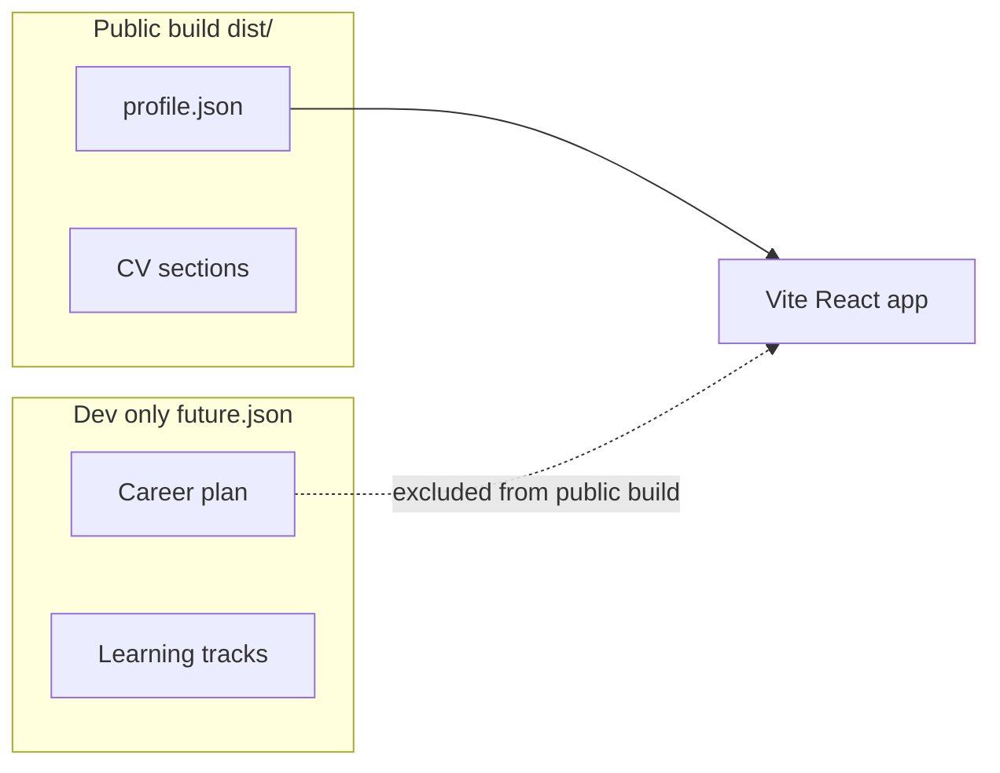

{/* AUTO-GENERATED from careerDev/docs/architecture/ — edit source there, then npm run arch:sync-all */}

Canonical architecture for **careerDev**. Diagrams render live via Mermaid on Orbit.

## Data model

