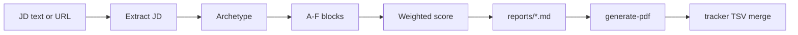
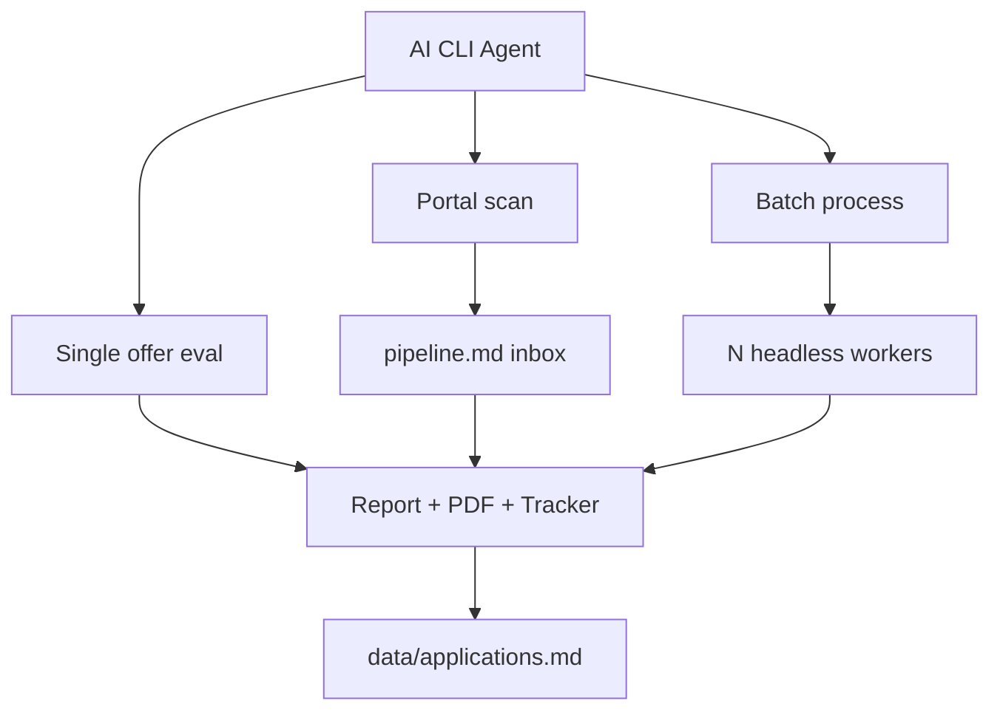

{/* AUTO-GENERATED from careerops/docs/architecture/ — edit source there, then npm run arch:sync-all */}

Canonical architecture for **careerops**. Diagrams render live via Mermaid on Orbit.

## Single-offer evaluation

## System overview

