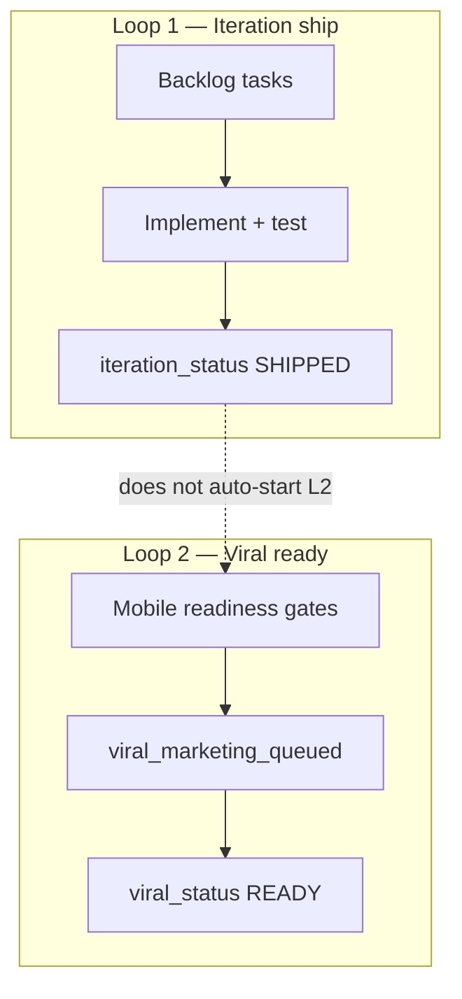
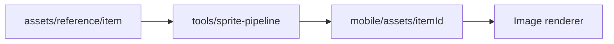
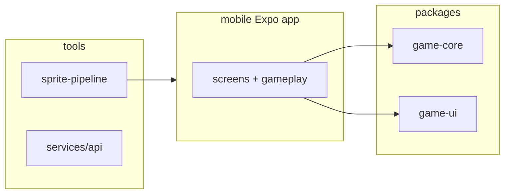

{/* AUTO-GENERATED from empty-window/app/docs/architecture/ — edit source there, then npm run arch:sync-all */}

Canonical architecture for **empty-window/app**. Diagrams render live via Mermaid on Orbit.

## Dual development loops

## Reference sprite pipeline

## Monorepo layout

