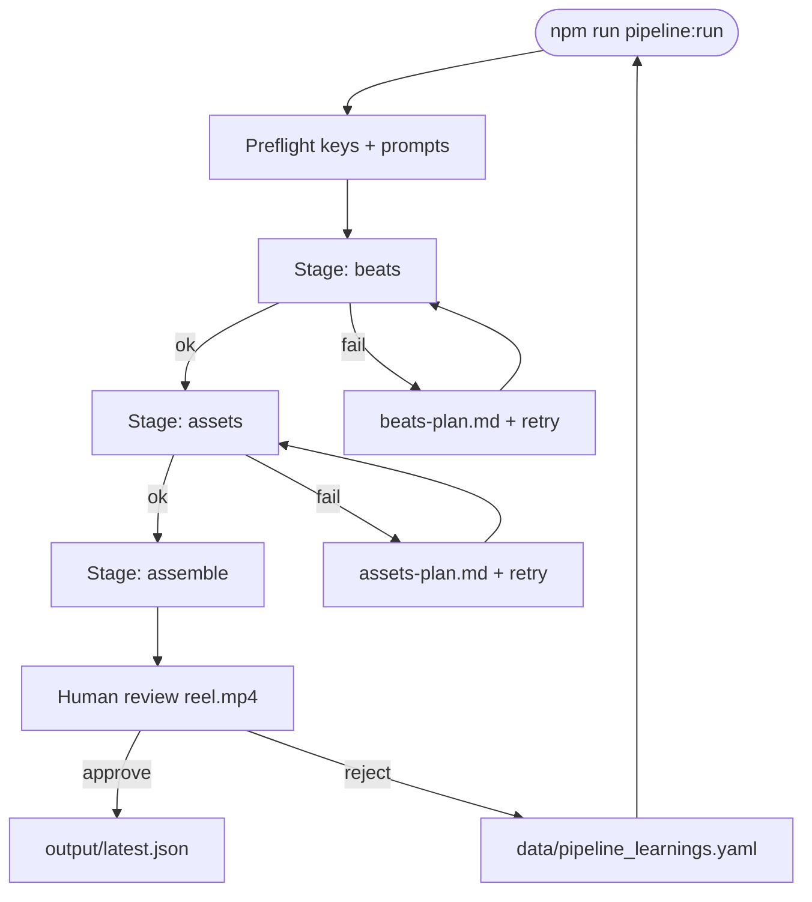
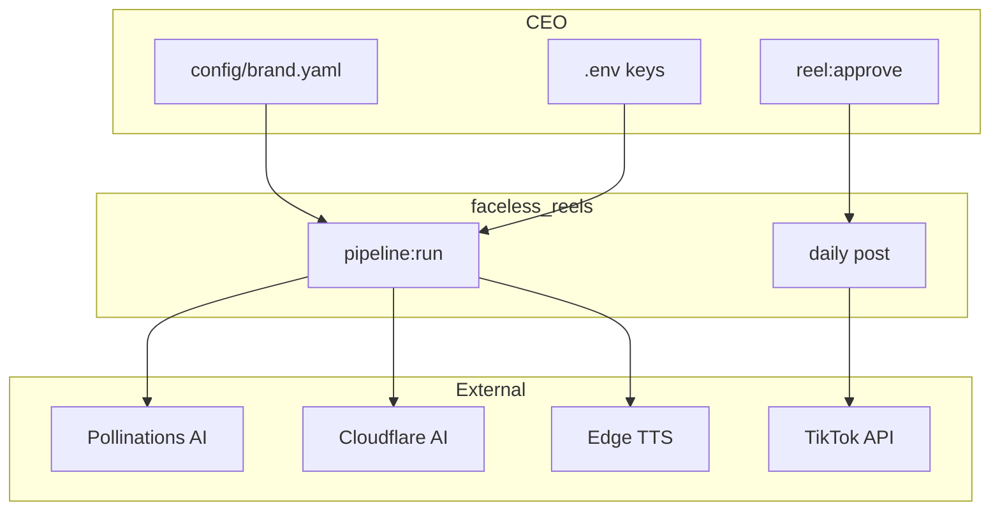

{/* AUTO-GENERATED from faceless_reels/docs/architecture/ — edit source there, then npm run arch:sync-all */}

Canonical architecture for **faceless_reels**. Diagrams render live via Mermaid on Orbit.

## Staged reel pipeline

One reel run: beats → assets → assemble → human review (`npm run pipeline:run`).

## System context

