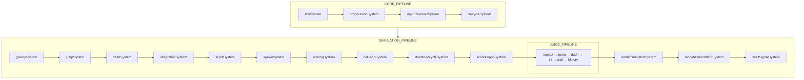
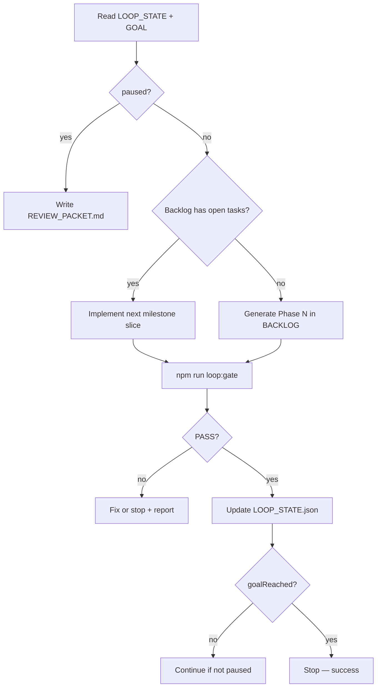
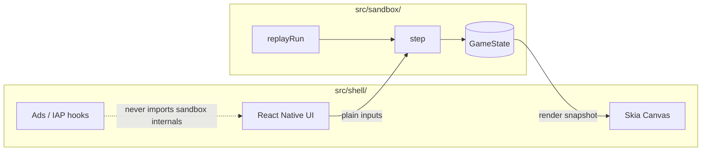

{/* AUTO-GENERATED from gameEngine/docs/architecture/ — edit source there, then npm run arch:sync-all */}

Canonical architecture for **gameEngine**. Diagrams render live via Mermaid on Orbit.

## Cartridge simulation pipeline

One vblank = one `step()`. Opcode order must match `src/sandbox/step.ts`.

**Public API:** `step`, `replayRun`, `getPendingShellSignals`, `serializeState` from `src/sandbox/index.ts`.

## Development loop

One autonomous iteration inside Cursor (from `LOOP.md`).

Gates: technical (`loop:gate`), architecture (`01-architecture.mdc`), aesthetics (Gate D), cartridge (`cartridge:audit`).

## System overview

Engine-less mobile game framework: **shell** owns platform I/O; **sandbox** owns deterministic simulation.

**Import rule:** `shell` may call sandbox public API (`src/sandbox/index.ts`). Sandbox **never** imports shell.

See `.cursor/rules/01-architecture.mdc` for enforcement.
