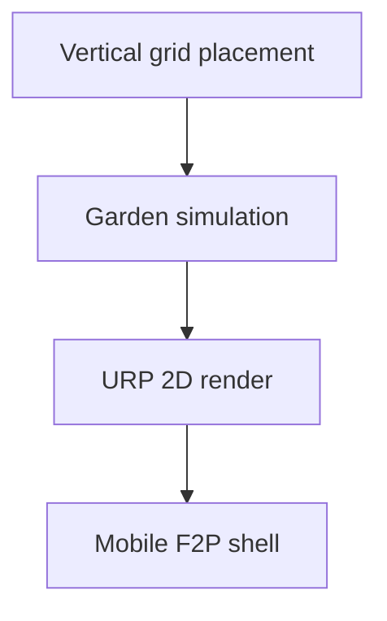

{/* AUTO-GENERATED from garden_app/docs/architecture/ — edit source there, then npm run arch:sync-all */}

Canonical architecture for **garden_app**. Diagrams render live via Mermaid on Orbit.

## Agent hat pipeline

## Unity runtime

