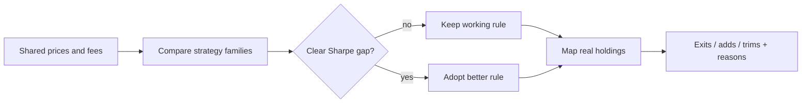

## The question

How do I review a stock sleeve so a change sits on evidence I can point at later — published research on what tends to work over multi-month horizons, plus numbers from *this* universe on a shared backtest — instead of a Monday headline, a name I like, or a fear of missing out?

Left alone I drift toward hunches. Ledger is the gate I put in front of that. I still click the trades myself. Nothing places orders.

**Live page:** [/ledger-research](/ledger-research)  
**Code:** [github.com/AlexTouvras/ledger](https://github.com/AlexTouvras/ledger)

## What Ledger does

Twice a year (I aim for spring and autumn) I run one command. It does two jobs in order:

1. **Which strategy family should I even be running?** Buy-and-hold the liquid list? Refresh a momentum book every month? Every six months? Change only a few names each review?
2. **Given that answer, what should I do with the stocks I hold today?** Sell these, buy those, trim this one, leave that one alone until next time — and *why*.

That second list is the part I use. "Exit X because twelve-month return is negative and I only allow three name swaps this review" beats "consider rebalancing."

## The mistake the first draft made

The first write-up asked: "Is my current rule research-backed?" That question is soft. Almost any rule can collect a citation.

The useful question is harder: among a few honest alternatives, which one wins on **the same data**, and is the win big enough that I should change how I work?

So the loop became:

- Compare a handful of strategy families side by side (same stocks, same fee assumption, same dates).
- Prefer the better risk-adjusted result, but if two are close and one trades far less, keep the quieter one.
- Only replace my working rule if the better option beats it by a clear margin (I use a Sharpe gap of about 0.08). Small differences stay notes.
- *Then* look at my real holdings under the rule I will actually run, and list exits / adds / trims with a short reason each.

## What the public page shows

The Orbit page is a cleaned copy of that run: charts, a KPI table, the decision, and the proposed changes. It does **not** show broker names or how many euros sit in each line. History is saved so I can open an older recommendation later and see what I was told then.

Private reports on my machine still have the full book detail for me. Public page = portfolio proof. Local CLI = how I actually prepare a review.

## Numbers from the first public run

On roughly 2021–mid-2026, about ninety liquid names, a simple fee model: a six-month momentum book that changes at most three names per review came out ahead on Sharpe among the stock strategies I allow for this sleeve. A monthly full refresh made similar money but turned over much more. Holding the whole universe equal-weight was almost as good on Sharpe with no trading — which is exactly why the change bar exists. I refuse to rewrite the playbook for a rounding error.

I also checked *which months* to review. April and October looked best in that window; the folklore "quiet" pair (May/November) did not. I'll use Apr/Oct as a schedule preference. I'm not treating five years and ~ten reviews as settled science.

## What stays manual on purpose

Broker APIs are stubs. A trading API key that can place orders does not belong in a cloud agent on a six-month timer until I've got a safer path. Some money (slow ETFs) never enters this loop at all.

## Takeaway

I built Ledger so portfolio changes start from **compare → decide → explain**, not from a mood. If a future run clears the change bar, the live page should disagree with today's working rule. That is the point of the system, not a bug.
