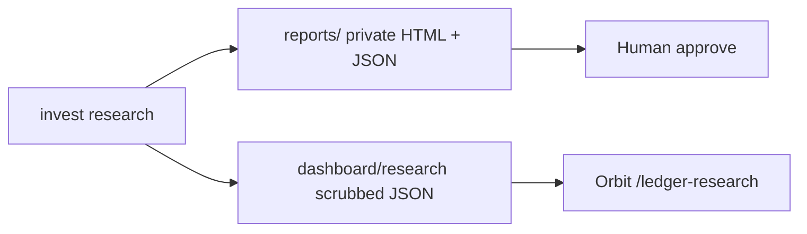

## The question

If a review tool starts from "is my current policy research-backed?", it will almost always say yes. How do you force the machine to pick among strategy families first, and only then explain the trades?

I built Ledger as a research sleeve for liquid equities: same sample, explicit selection rules, human approval before anything live. The public demo lives on this site; the private run still knows book sizes and broker labels that never leave my machine.

**Live demo:** [/ledger-research](/ledger-research)  
**Code:** [github.com/AlexTouvras/ledger](https://github.com/AlexTouvras/ledger)

## What "selection first" means

The early write-up was a confirmation memo. Useful as a checklist; useless as a decision engine. The rewrite flips the order.

1. Lock constraints (long-only liquid names, prefer lower turnover when Sharpes are close, human gate on trades).
2. Run candidate families on one fee model: broad ETF buy-and-hold as opportunity cost, universe equal-weight, momentum at monthly / semiannual / quarterly with full or capped name changes.
3. Rank eligible stock strategies by Sharpe. If the leader churns hard and a near-Sharpe rival turns over much less, take the rival.
4. Switch the working policy only if the edge clears a Sharpe change bar (0.08 in the current config). Thin wins stay notes, not rewrites.
5. Only then run the holdings pass under the **run** policy and attach a why to each EXIT / ADD / TRIM / DEFER.

That last step is what people want to see: not a vague "rebalance," but "exit this name because 12m momentum is negative and it uses one of three change slots."

## What ships where

`invest research` writes both surfaces. Private reports keep book euros and broker context for me. The Orbit page gets indexed equity, KPIs, decision text, and proposals with weight deltas in percentage points — no broker names, no absolute euro amounts. Each run also appends to a history index so I can open an older recommendation later.

On the sample we used for the first public publish (roughly 2021 through mid-2026, ~90 liquid names, 5 bps fee model), semiannual momentum with a max-3 name-change cap led the eligible set on Sharpe (~1.30). Monthly full refresh was close on return and much higher turnover. Universe equal-weight sat almost on top of that Sharpe with zero turnover, which is why the change bar exists: you do not rewrite policy for noise.

## Calendar is a knob, not the thesis

A separate sweep asked which six-month month-pair looked best in-sample. April + October won that window; May + November did not, despite the "quiet months" folklore. That result is scheduled as preferred review months under whatever momentum family wins. It is not a substitute for family selection, and a five-year sample with ~10 rebalances is too thin to treat as gospel.

## What I refuse to automate yet

Broker APIs stay stubs. A Nordnet key is full account access, not read-only, so a cloud agent every six months is the wrong place to park it. Holdings for a live review still come from a local snapshot (and later a Slack post or a careful local fetch). Saxo core ETFs and ring-fenced bank ETFs stay out of this loop on purpose.

The public page is a portfolio artifact. The private CLI is the ops console.

## Takeaway

Strategy selection and trade explanation are different jobs. Ledger runs them in that order, publishes a scrubbed demo on Orbit, and keeps the euro-level book off the internet. If the next cycle clears the change bar, the article and the live page should disagree with today's working policy — that would mean the loop is doing its job.
