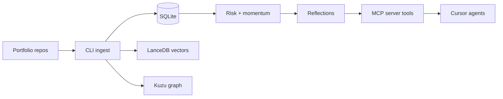

{/* AUTO-GENERATED from Memory/docs/architecture/ — edit source there, then npm run arch:sync-all */}

Canonical architecture for **Memory**. Diagrams render live via Mermaid on Orbit.

## ProjectBrain ingest loop

