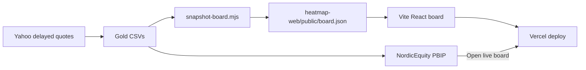

## The question

When a market board has to feel like a desk tool — sector groups, company logos, day-change % on every tile, click to zoom — do I keep fighting the native Power BI treemap, or do I put the chrome where the chrome belongs and leave the report for the rest of the story?

I already had a Nordic Equity report in the portfolio kit: Landing → Heatmap → Ticker Explorer → Signal Desk → Context. The Heatmap page could show a treemap. It could not honestly look like a TradingView-style sector board without lying about what Desktop will render. So the live board became a small Vite app, and the report keeps an **Open live board** button pointed at it.

**Live board:** [heatmap-web-five.vercel.app](https://heatmap-web-five.vercel.app)  
**Code:** [github.com/AlexTouvras/powerbi-portfolio/tree/main/01-finance/heatmap-web](https://github.com/AlexTouvras/powerbi-portfolio/tree/main/01-finance/heatmap-web)

## What the board is for

One screen. Nordic large-caps across FI / SE / DK / NO. Tile **size** is market cap (EUR m). Tile **color** is day change %. Sector headers are clickable; click once to show only that sector, **All** to reset. Advance / decline counts sit in the header so you can feel breadth without opening a second visual.

The snapshot I built from on 2026-07-24 held **82** names. That count will move when gold rebuilds — the point is a liquid Nordic large-cap universe, not a fixed roster.

## Why not force it inside Power BI

Native treemaps are fine for "which sector is big." They are awkward for logos, dense % labels, and TradingView-ish chrome. I tried the path of least resistance first: keep everything in PBIR. The honest version of that path is a weaker board, or a screenshot that pretends the interactive chrome ships in Desktop.

Splitting the board out cost a second deploy surface. It bought a layout I control with `d3-hierarchy` (squarify), SVG tiles, favicon logos with ticker fallbacks, and a resize observer so the board fills the host instead of a fixed artboard. The report stays the place for price series, RSI queues, and Context caveats. The board stays the glance layer.

## Same gold, two consumers

Both surfaces read the same curated layer. `scripts/build-gold.mjs` writes company and price gold. `scripts/snapshot-board.mjs` filters latest prices into `board.json` for the web app. Weekdays, a GitHub Action can refresh gold, rewrite the snapshot, commit if anything changed, and optionally hit a Vercel deploy hook so the public board does not sit on Friday's tape.

The PBIP semantic model still needs Desktop (or Fabric) refresh on its own. The Action updates git and the web board; it does not magically refresh an open Desktop session. I leave that split visible on purpose — silent "live" claims are how portfolios lose trust.

## What this is not

Yahoo Finance delayed quotes. Not investment advice. No ML price forecast on this board. Signal Desk lives in the report for RSI mean-reversion research; the heatmap does not pretend to be a trading system. If a logo fails to load, you get a two-letter ticker fallback — that is fine; chrome should degrade before data does.

## Takeaway

Ship the interaction where the interaction is cheap. Power BI still owns the Nordic Equity narrative and the model. The Vite board owns the market-desk glance. One gold layer, two honest surfaces — and a button that admits the treemap was never going to carry the logos.
