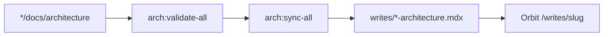

{/* AUTO-GENERATED from website/docs/architecture/ — edit source there, then npm run arch:sync-all */}

Canonical architecture for **website**. Diagrams render live via Mermaid on Orbit.

## Architecture sync pipeline



## Orbit content zones

```mermaid
flowchart TB
  Hub[Hub /] --> Writes[Writes MDX]
  Hub --> Portfolio[Portfolio + Workshop]
  Hub --> Radar[Signals RSS cache]
  Studio[/studio JSON edits] --> Hub
  Cron[news:fetch cron] --> Radar
  MDX[MDX + Mermaid] --> Writes
  MDX --> Portfolio
```
