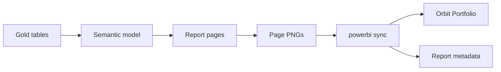
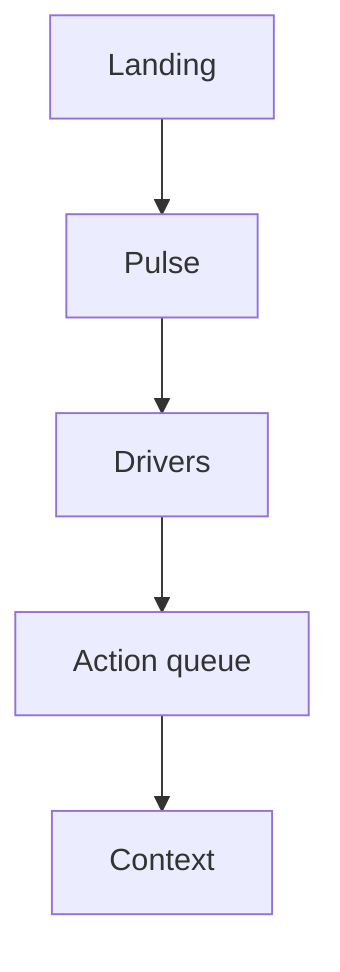
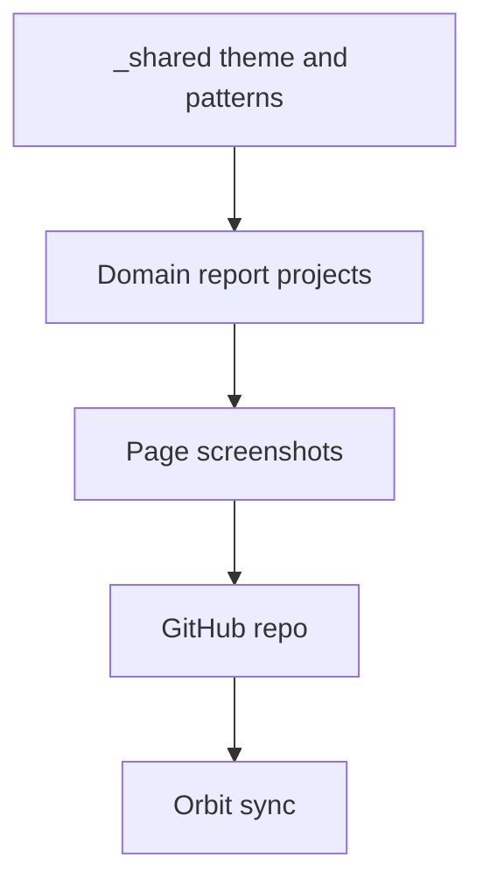

## The question

When someone opens a report cold on a Monday, what should work without a walkthrough: the theme, or the path from "are we okay?" to "who do we act on?"

I build these reports after years in Nordic banking on PD models, scorecards, and expected-credit-loss style work. The portfolio is practice for the same habit: take a messy commercial question (churn, sales health, engagement, clinical risk) and land it in a shape that repeats, with caveats written down instead of waved away.

The public repo is [powerbi-portfolio](https://github.com/AlexTouvras/powerbi-portfolio). Orbit shows the same pages under Portfolio → Power BI. This write-up is the system behind those screenshots: what I build, why the order is fixed, and how it reaches the site.

## What "gold" means here

In data-platform talk, teams often split work into bronze / silver / gold. **Bronze** is close to the source extract. **Silver** is cleaned and joined. **Gold** is the curated, analysis-ready layer: tables and grains you would trust for a KPI, usually shaped for a star schema (facts + dimensions) so measures stay honest.

When I say gold in this portfolio, I mean that curated layer, not a brand name. If the gold grain is wrong, no amount of page polish saves the report.

## The pipeline (how)

Gold tables and measures come first. The **semantic model** is the Power BI model file (relationships, DAX measures, what a slicer is allowed to filter). Pages sit on a shared Nordic Boardroom look: quiet chrome, a clear KPI strip, explanation before action lists.

I export each page to PNG so Orbit can show the work without embedding a live Fabric workspace for every visitor. `npm run powerbi:sync` (and the GitHub Action) refreshes those images plus metadata into this site. The screenshot should match what is committed; otherwise the site becomes a prettier lie than the repo.

## The page path (why this order)

**Landing** states the question and who the report is for. **Pulse** answers "are we okay?" with a few durable KPIs. **Drivers** answers "why?" (influencers, decomposition, mix views). **Queue** answers "who do we call next?" **Context** holds model limits: storage mode, score meaning, what the numbers are not.

That order is deliberate. A matrix on page one loses people who only have two minutes. A pretty Pulse with no queue loses people who need a next action. Same path every time means a new domain report can reuse the grammar instead of inventing navigation.

I don't pretend Import mode is Direct Lake, or that a propensity score (a model probability someone will churn / readmit / etc.) is ground truth. Context is where that honesty lives.

## Shared stack (what scales)

Theme, page grammar, and export rules live under `_shared`. Each domain report (churn, sales, banking, healthcare, and whatever comes next) plugs into that kit. New work should start from shared patterns, not a blank file and a one-off layout.

Churn is a good example of the path under load: risk on Pulse, Key Influencers and decomposition on Drivers, an at-risk queue sorted by score. Sales leans status-first, then product and concentration. Other domains reuse the same reader path with their own gold.

## What I care about more than polish

Measures that match the grain of the decision. Slicers that don't blow up the model. A Context page that says what the model can't do. Screenshots that track the committed report definition.

I still argue with myself about Direct Lake vs Import for demos. Import keeps the cold-open story simple here: the PNG is what shipped, and the model is sized for a laptop walkthrough, not a capacity theater.

## How to see it

On Orbit: [Portfolio → Power BI](/portfolio#power-bi). Full diagram set: [Power BI portfolio — architecture](/architecture/powerbi-portfolio). Repo: [AlexTouvras/powerbi-portfolio](https://github.com/AlexTouvras/powerbi-portfolio).

## Takeaway

A report earns its slot when Landing → Pulse → Drivers → Queue works without a narrator. Theme is the easy part. The hard part is the contract between gold tables, measures, and the page that names who to contact next.
