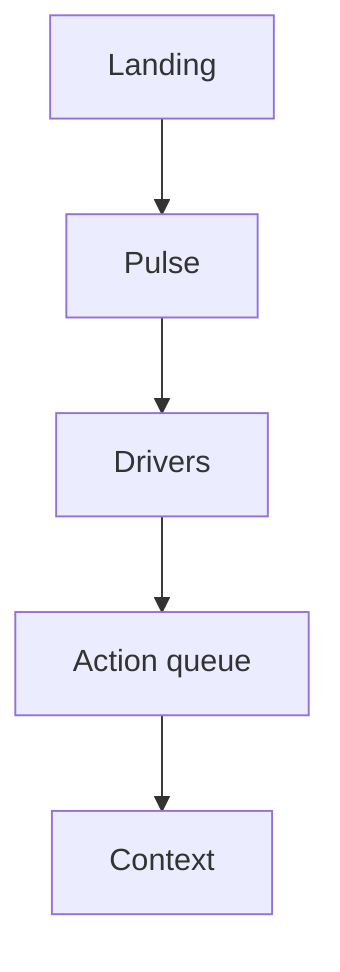

## The question

When someone opens a report cold on a Monday, with two minutes and no walkthrough, what has to work: the theme, or the path from "are we okay?" to "who do we act on?"

I spent years in Nordic banking on PD models, scorecards, and expected-credit-loss style work. The habit that survived was not a color palette. It was: take a messy commercial question, land it in a shape that repeats, and write the caveats down instead of waving them away. This portfolio is that habit practiced in public — churn, sales health, bank engagement, clinical risk — under one Nordic Boardroom grammar.

**See it:** [Portfolio → Power BI](/portfolio#power-bi)  
**Repo:** [github.com/AlexTouvras/powerbi-portfolio](https://github.com/AlexTouvras/powerbi-portfolio)

## Gold before chrome

In data-platform talk, bronze sits close to the extract, silver is cleaned and joined, and **gold** is the curated layer you would trust for a KPI — usually fact and dimension tables shaped so measures stay honest.

When I say gold here, I mean that layer, not a brand. If the grain is wrong, page polish only makes the lie prettier. So every report starts with gold tables and measures, then a **semantic model** (relationships, DAX, what a slicer is allowed to filter), then pages. Screenshots come last.

I export each page to PNG so Orbit can show the work without embedding a live Fabric workspace for every visitor. `npm run powerbi:sync` (and the GitHub Action) refreshes those images plus metadata into this site. If the PNG drifts from what is committed, the site becomes a prettier lie than the repo.

## The page path I refuse to invent twice

**Landing** states the question and who the report is for — a poster cover, not a matrix. **Pulse** answers "are we okay?" with a few durable KPIs. **Drivers** answers "why?" (influencers, decomposition, mix). **Queue** answers "who do we call next?" **Context** holds model limits: storage mode, what a score means, what the numbers are not.

That order is deliberate. A dense matrix on page one loses people who only have two minutes. A pretty Pulse with no queue loses people who need a next action. Same path every domain means a new report reuses the grammar instead of inventing navigation.

I don't pretend Import mode is Direct Lake, or that a propensity score (churn, readmit, and the rest) is ground truth. Context is where that honesty lives.

## What scales is the kit, not one hero report

Theme, page grammar, and export rules live under `_shared`. Each domain report plugs into that kit. New work should start from shared patterns, not a blank canvas and a one-off layout.

Churn is the path under load: risk on Pulse, Key Influencers and decomposition on Drivers, an at-risk queue sorted by score, then Context. Sales leans status-first, then product and concentration. Bank and care reports reuse the same reader path with their own gold. Nordic Equity also has a clickable TradingView-style board at [heatmap-web-five.vercel.app](https://heatmap-web-five.vercel.app) — logos, day-change %, sector zoom — because native Power BI treemaps don't carry that chrome well.

## What still fights me

I still argue with myself about Direct Lake vs Import for demos. Import keeps the cold-open story simple here: the PNG is what shipped, and the model is sized for a laptop walkthrough, not a capacity theater.

I also care more about boring correctness than polish: measures that match the grain of the decision, slicers that don't blow up the model, a Context page that says what the model can't do, screenshots that track the committed definition.

Full diagram set: [Power BI portfolio — architecture](/architecture/powerbi-portfolio).

## Takeaway

A report earns its slot when Landing → Pulse → Drivers → Queue works without a narrator. Theme is the easy part. The hard part is the contract between gold tables, measures, and the page that names who to contact next.
