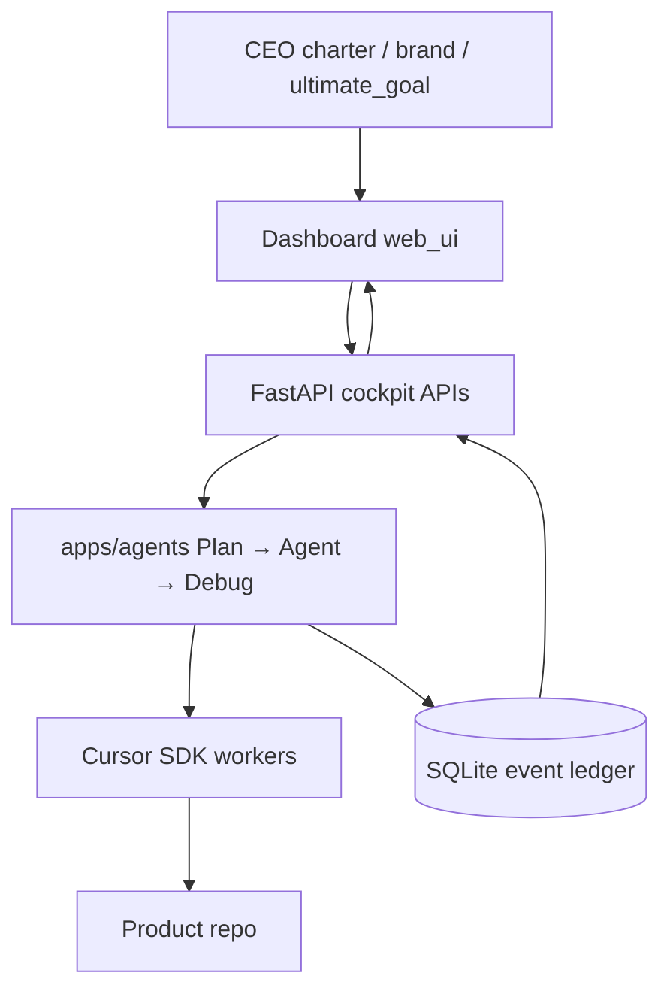

> **Status (2026-07-22): retired.** ProjectHelm (JARVIS) is no longer how I run the portfolio. The operating system is Cursor **rules + skills**, with each product (Orbit, Power BI, AlphaForge, …) owning its own kit and UI. The essay below is historical.

## The question

When two or three agents touch the same repo in one evening, how do I answer on Monday: what was decided, what actually ran, and what still needs me?

Cursor is strong at local edits. It is weak as a system of record. Plans live in chat. Child agents disappear when the tab closes. Failed checks become another prompt instead of a named Debug phase. I kept losing the thread between "we agreed to fix the tests" and "which agent touched `writes.ts`?"

ProjectHelm (the JARVIS workspace) is my answer: a thin control plane on my machine. Not another chat UI. State, phases, and a ledger around the Cursor SDK.

## The control plane

The FastAPI cockpit owns start/status/kill for the CEO loop. Agents call into the Cursor SDK with bounded context. Outcomes append to an event ledger (SQLite). If it isn't in the ledger, I treat it as rumor.

## Phases I refuse to leave implicit

**Plan** forces a scoped breakdown: owners, done criteria, what "good" looks like before anyone edits. Vague goals stay stuck here on purpose.

**Agent** dispatches work. Child agents get a job, not the whole chat history. That boundary is the whole point; context rot is how you get confident wrong patches.

**Debug** starts when verification fails. Evidence in, guesswork out. I still improvise sometimes, but the phase name makes the failure visible instead of burying it in a longer prompt.

**Ledger** is the audit trail. Monday-me can reconstruct Tuesday-night-me without scrolling Discord.

## Design choices I'm keeping

Local-first. No per-agent cloud bill for a personal workshop. Explicit phase names beat prompt tone. Kill switch in the UI so I don't hunt PIDs. The IDE still edits files; ProjectHelm coordinates.

I'm not building multi-user permissions or auto-merge. Merge stays human. Fully autonomous shipping is a different product and I'm not pretending this is that.

## Where it still breaks

Ledger richness depends on how honest the agent wrappers are about what they did. If a child agent skips writing an event, the dashboard looks calm and lies. Plan quality is still on me; a sloppy plan just becomes a faster mess. Desktop + API + IDE is more moving parts than "open Cursor and vibe," and some weeks I skip the control plane when the task is tiny. That's fine. Tools you only use for multi-agent nights still earn their keep.

## Why I published this

Delivery leadership and agent systems share a habit: name the loop, keep evidence, don't confuse activity with outcomes. ProjectHelm is the workshop version of that habit. Full diagrams: [JARVIS (ProjectHelm) — architecture](/architecture/jarvis).

## Takeaway

Treat agents like workers with a foreman. Build the foreman layer first: phases, state, and a log you can read when you're tired. The model is replaceable. The contract isn't.
