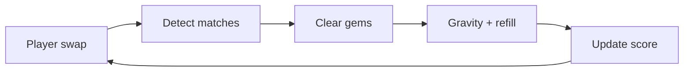
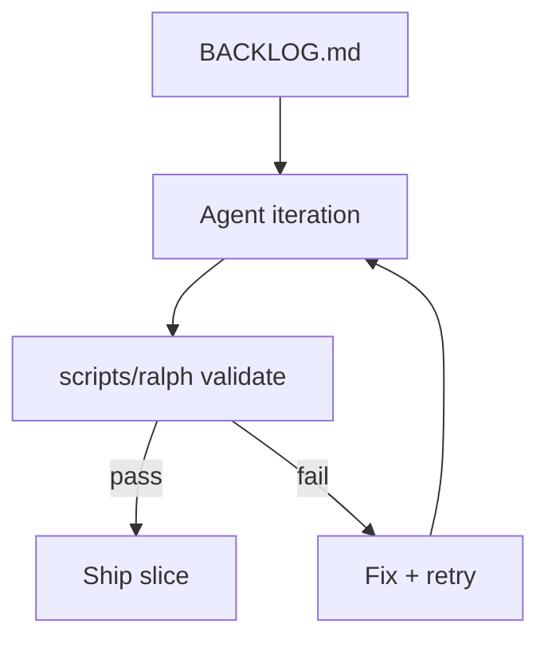

{/* AUTO-GENERATED from puzzle-loop/docs/architecture/ — edit source there, then npm run arch:sync-all */}

Canonical architecture for **puzzle-loop**. Diagrams render live via Mermaid on Orbit.

## Match-3 game loop

## Ralph iteration loop

