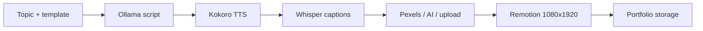
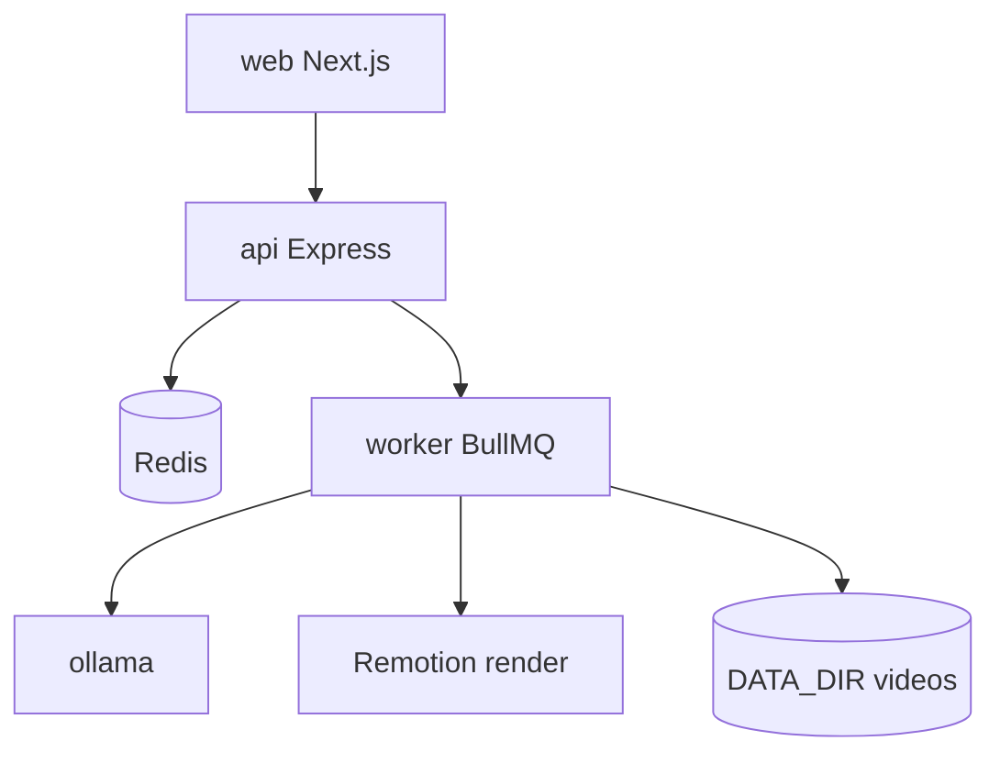

{/* AUTO-GENERATED from Reelsmaker/docs/architecture/ — edit source there, then npm run arch:sync-all */}

Canonical architecture for **Reelsmaker**. Diagrams render live via Mermaid on Orbit.

## Render pipeline

## Docker topology

