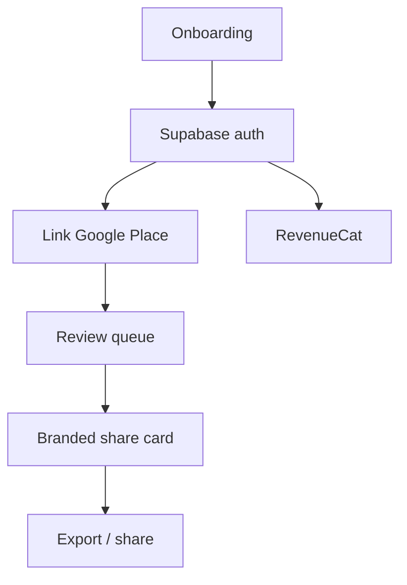

{/* AUTO-GENERATED from review_app/docs/architecture/ — edit source there, then npm run arch:sync-all */}

Canonical architecture for **review_app**. Diagrams render live via Mermaid on Orbit.

## ReviewSnap flow

