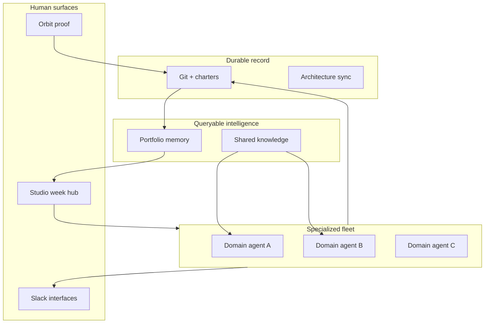

## The question

The graveyard is not too many repos. It is too little *transfer*. You ship a coach, a knowledge vault, a portfolio brain, three field cards — and six months later you are back at zero, re-explaining governance to a model that forgot Tuesday. I built the current stack to stop that leak. The longer question underneath is sharper: if one engaged operator can wire memory, knowledge, proof, and life systems into a single compounding loop today, what becomes buildable tomorrow — in any domain the models have not invented yet?

This is not a tour of side projects. It is a bet on **foundational know-how**: how humans should build when LLMs are fast, cheap, and tool-hungry. The individual repos (Orbit, ProjectBrain, Ravens, fitness-coach, field cards, analytics portfolio, fleet ops) are exercises in the same grammar. The product is the grammar.

## Foundations, not features

Strip the names and you get four primitives I intend to reuse on whatever I build next.

**Durable artifacts beat chat.** Git, charters, architecture indexes, handoff files — the record survives the session close button. Chat is a UI; disk is truth. Every project taught the same lesson: if the automation did not commit, it did not happen.

**Knowledge must be citable and shared.** Ravens is the vault — scan, promote, catalog, contract-versioned markdown. Fitness kickoffs, field-card spines, and essays pull from one well so the next build starts informed, not from a blank prompt.

**Memory must be queryable across domains.** ProjectBrain holds portfolio scores, decisions, patterns, vectors, graph hops. New work asks "what did we learn when we shipped a human-gated Slack workflow?" instead of archaeology in closed threads.

**Proof must be public and gated.** Orbit publishes the story; Approve links and review agents keep production deploys fail-closed. Strangers see the workshop; only signed intent ships.

None of that is domain-specific. Banking analytics, training physiology, job-search pipelines, parenting notes — different surfaces, same spine. That is the know-how: **compose specialized agents on shared infrastructure with explicit write scopes**, not spin up another isolated chat.

The diagram is the thesis. Projects are instances. The wiring is the curriculum.

## What is already live (not a roadmap slide)

I used to describe the next phase as "one to two years out." That was pessimistic. **The ambient week hub is running.**

Monday I open Studio and the week is already reconciled: training plan with Heimdall technique clips, Ravens signals on agent governance, career scan queues, field-card diffs from Friday review, fleet digest if a heartbeat missed. Specialized automations — Huginn, Muninn, `coach-week`, field-card review, daily meta-check — do domain work. Shared knowledge and portfolio memory connect them. No mega-agent hallucinating across my life; a **fleet with contracts**.

Slack is the phone UI. `#fitness` takes `log:`, `intent:`, `goal:` with different write permissions. `#orbit` holds essay Approve. `#ops-channel` gets propose-only fixes. Prefix routing is how you teach agents scope without a 200-line system prompt every session.

Pattern transfer is live too. `setup_new_project` pulls playbooks from winner repos. Evolution scout proposes adoptions behind an eval gate. Session handoffs read `CURRENT_STATE` before the model improvises. I am not waiting for better models to make this real; I am waiting for discipline to compound what already works.

The current repos matter as **proof of the primitives**, not as a cap on ambition. [Building Orbit](/writes/building-orbit), [portfolio memory](/writes/when-the-portfolio-needs-a-memory), [the coach loop](/writes/when-the-coach-lives-in-git-and-slack) — evidence logs. The skill being trained is larger: **operate a personal engineering stack where the bottleneck moves from "can I build it?" to "which domain deserves the next sprint?"**

## The longer bet: a workshop that can build anything

Here is where I stop hedging for the hiring manager and say the quiet part.

The end state looks less like "nice portfolio" and more like **a personal engineering lab at the edge of what one human with a fleet can run** — the workshop behind the suit, if you want the pop-culture shorthand. Not cosplay. Receipts. Sensors, git, agents, gates, public proof. Build a coach this quarter, a clinical analytics suite next, a household system after that, a delivery ops agent for the day job — same forge, different ingots.

**Instant context on any new problem.** Portfolio graph + semantic search + Ravens domains mean the first hour of a greenfield repo is charter, constraints, and stolen patterns — not whiteboard theater. The model arrives briefed.

**Specialized builders, shared standards.** Field cards enforce spines (RAG → AGENT → MCP → A2A; ASK → GRAIN → TRUTH → USE; INTENT → WINDOW → PROOF → CUTOVER). Fitness enforces physiology tied to logs. Analytics enforces gold-before-chrome. The next project inherits the discipline automatically.

**Closed loops that close.** Research → draft → review → publish → ingest → reflect. Weekly cards, Sunday training plans, daily knowledge promotion, blog essays with human Approve — each loop teaches the next automation where it is allowed to touch.

**Scale without headcount.** One operator, a dozen active repos, unattended jobs that fail closed, a public face that stays honest. That ratio is the point. LLMs gallop; the moat is **architecture that lets one person ship like a small team** without pretending one person is a team.

Push that five years with models that keep improving on tool use, vision, and long context: the workshop prototypes in conversation, validates against real data contracts, ships through the same gates, and **records the decision so the fleet never relearns the same mistake**. Parenting notes age with the kid. The coach and mealplan share goals. Delivery spines rhyme with Azure ops by day. A new domain is a new charter plus wiring — not a new life.

I am not promising sentience or zero human oversight. I am promising something more useful: **a reproducible method for augmented engineering** that compounds. The Tony Stark fantasy is not the glowing chest piece. It is the conviction that with the right lab, one builder can reach problems that used to require a department — and leave an audit trail while doing it.

## What stays human

Gates stay. Clinical pain still means see a clinician. Approve links stay fail-closed. Some repos pause; scores lie politely when ingest lags. Cloud agents still cannot see `~/.cursor`. Vision without those limits is brochure fiction — but limits are design choices, not an apology for thinking big.

## Takeaway

The projects are foundational work: how to record, remember, cite, gate, and prove when humans build with agents. The fleet is already ambient. The longer game is a **personal workshop capable of spawning the next thing** — whatever "next" is when the models move again.

If you want someone who has lived that stack, not slid it on a deck, ask for the repos and the Monday mess. The universe is running. The interesting hire is the person who knows how to extend the forge.

Architecture index: [/architecture/orbit-platform](/architecture/orbit-platform) · [/architecture/projectbrain](/architecture/projectbrain) · [/architecture/fitness-coach](/architecture/fitness-coach).
