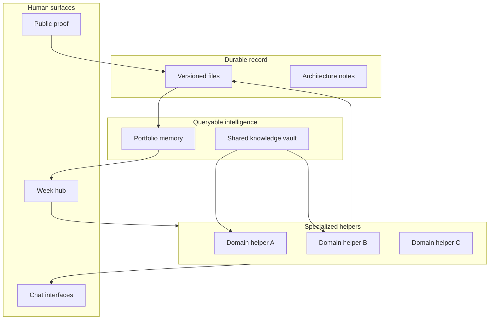

## The question

I used to treat unfinished repos like a personal failure. The real failure was quieter. I would finish a training coach, a notes vault, a public site, a few portfolio studies, then open a new folder six months later and explain the same rules to a fresh chat as if Tuesday never happened.

Too many projects is not the disease. Too little transfer is. The question underneath is practical: if one person can wire memory, shared notes, proof, and day-to-day tools into a loop that compounds, what becomes easier to build next, including work that has nothing to do with software?

This is not a tour of nicknames. It is a bet on method. The individual apps are practice reps. The product is the grammar they share.

## Four habits that survive a blank folder

Strip the brand names and four habits remain. I expect to reuse them on whatever I build next.

**Write it where it survives the tab close.** Chat is a temporary desk. The record that matters lives in versioned files: a short charter, an architecture note, a handoff page that says what is true today. If the automation did not leave a file, I treat the work as unfinished.

**Keep knowledge in one place you can cite.** I maintain a shared vault of notes and signals (internally I call it Ravens). Training kickoffs, field-study templates, and blog drafts pull from that well so the next build starts informed instead of from a blank prompt.

**Make memory searchable across domains.** A separate local portfolio brain holds decisions, patterns, and project scores. New work can ask "what did we learn the last time a human had to approve a publish step?" without digging through closed threads.

**Publish in public, ship only with signed intent.** The site (Orbit) shows what I am willing to stand behind. Approve links and review steps keep production changes fail-closed. Strangers can see the workshop; only an explicit yes ships.

None of that is locked to dashboards or chatbots. Banking analytics, training physiology, job-search pipelines, household notes: different surfaces, same spine. The know-how is compose specialized helpers on shared infrastructure with explicit write scopes, not spin up another isolated conversation that forgets you by Friday.

Projects are instances. The wiring is the curriculum.

## What is already live

I used to describe the next phase as one to two years out. That was pessimistic. The week hub is running.

Monday I open a private week hub and the picture is already reconciled: a training plan with technique clips, notes worth promoting from the shared vault, career-scan queues, diffs from Friday review, a digest if an overnight job missed a heartbeat. Specialized automations do domain work. Shared knowledge and portfolio memory connect them. There is no single mega-assistant inventing my life. There is a fleet with contracts: each helper may write only where its channel allows.

Chat apps are the phone UI. One fitness channel accepts log lines, training intent, and goals with different write permissions. Another channel holds essay Approve before anything hits the public site. An ops channel gets propose-only fixes. Prefix routing is how you teach scope without pasting a novel of instructions into every session.

Pattern transfer is live too. New project setup pulls playbooks from repos that already shipped. An evolution scout proposes adoptions behind an evaluation gate. Session handoffs read a current-state file before the model improvises. I am not waiting for smarter models to make this real. I am waiting for discipline to compound what already works.

The repos matter as proof of the primitives, not as a ceiling on ambition. Earlier posts on [building Orbit](/writes/building-orbit), [portfolio memory](/writes/when-the-portfolio-needs-a-memory), and [the coach loop](/writes/when-the-coach-lives-in-git-and-slack) are evidence logs. The skill being trained is larger: operate a personal engineering stack where the bottleneck moves from "can I build it?" to "which domain deserves the next sprint?"

## The longer bet

Here is the quiet part without the comic-book metaphor.

The end state looks less like a tidy portfolio and more like a personal lab at the edge of what one human with helpers can run. Sensors, version control, agents, gates, public proof. Build a coach this quarter, a clinical analytics suite next, a household system after that, a delivery ops helper for the day job: same forge, different ingots.

Instant context on a new problem means the first hour of a greenfield repo is charter, constraints, and stolen patterns, not whiteboard theater. Specialized builders inherit shared standards: field-study spines for discovery, physiology tied to logs for training, gold-before-chrome for analytics. Closed loops close: research, draft, review, publish, ingest, reflect. Each loop teaches the next automation where it is allowed to touch.

Scale without headcount is the point. One operator, a dozen active repos, unattended jobs that fail closed, a public face that stays honest. Models get faster. The moat is architecture that lets one person ship like a small team without pretending one person is a team.

Push that several years with better tool use and longer context and the workshop prototypes in conversation, validates against real data contracts, ships through the same gates, and records the decision so the fleet never relearns the same mistake. Parenting notes age with the kid. The coach and meal planner share goals. Delivery spines rhyme with Azure ops by day. A new domain is a new charter plus wiring, not a new life.

I am not promising machines that run themselves. I am promising something more useful: a reproducible method for augmented engineering that compounds, and an audit trail while doing it.

## What stays human

Gates stay. Clinical pain still means see a clinician. Approve links stay fail-closed. Some repos pause. Scores lie politely when ingest lags. Cloud helpers still cannot see my local portfolio brain. Vision without those limits is brochure fiction. Limits are design choices, not an apology for thinking big.

## Takeaway

The projects are foundational work: how to record, remember, cite, gate, and prove when humans build with AI assistants. The helpers are already ambient. The longer game is a personal workshop capable of spawning the next thing, whatever "next" is when the tools move again.

The nicknames are optional. The habits are not. If nothing transfers between projects, you are collecting folders, not building a practice.

Architecture index: [/architecture/orbit-platform](/architecture/orbit-platform) · [/architecture/projectbrain](/architecture/projectbrain) · [/architecture/fitness-coach](/architecture/fitness-coach).
