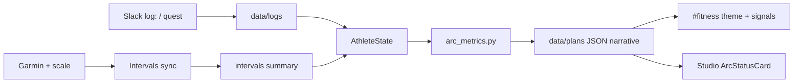

## The question

If I already had a coach that reads CTL/TSB and writes my week in Slack, why bolt on gate ranks, warrior quotes, and a pixel avatar that looks like it wandered out of a dungeon crawl?

Because the physiology was working and the *story* wasn't. I could open `#fitness` on Sunday and see "Wednesday: strides, RPE honest, protect Fri long." Correct. Also the emotional warmth of a parking ticket. The numbers lived in a signals list at the bottom. CTL 14.87. TSB +11. Body fat down a kilo. My brain filed them under "spreadsheet" and moved on.

I wanted the same receipts to feel like progress — without lying about what they mean.

## The cosplay trap (and how I dodged it)

Arc Mode is not "AI thinks you're a hunter." Solo Leveling cosplay with zero math is how apps get uninstalled by Wednesday.

The rule I kept: **every stat must trace to a sensor or a log line**. If Garmin stops syncing VO₂max, AGI falls back to run CTL. If I skip `log: lift` for two weeks, STR stops pretending. If TSB crashes through −20, the gate **seals** at rank D and the plan says so in plain English: recovery protocol, not hero Wednesday.

The skin is playful. The plumbing is still [`athlete_state.py`](https://github.com/AlexTouvras/fitness-coach) plus Intervals sync and Slack RPE — the same loop described in [the first coach essay](/writes/when-the-coach-lives-in-git-and-slack). Arc Mode is a HUD on top, committed to git as `narrative` inside each week's `data/plans/YYYY-Www.json`.

## The card: what you actually see

Picture a violet-bordered panel at the top of the week (Studio week log renders it as `ArcStatusCard`; Slack gets the theme line and signals).

On the left: my pixel avatar and the word **Warrior**, which is slightly embarrassing and therefore correct.

Center top: **Arc Mode · Gate C · score 51** (real numbers from sharpening week 2026-W36). Hover the rank and it explains the band: composite 50–62, solid block execution, phase ceiling B until race week closes in. Hover the score and you get the weights: AGI 45%, VIT 25%, STR 20%, PER 10%.

Four stat tiles underneath:

| Stat | What it is | That week |
| --- | --- | --- |
| **STR** | Session-RPE EWMA from Slack lift logs | 48 — strength CTL 0.7 (I had logged one lift; the stat knows) |
| **AGI** | Garmin VO₂max when present, else run CTL | 44 — VO₂ 50.0 |
| **VIT** | TSB, HRV vs baseline, sleep score/duration, form zone | 68 — TSB +11, form **fresh** |
| **PER** | Body-fat % from the scale; direction matters | 42 — 24.1% BF, 14d weight −1.04 kg |

Below that: a Musashi quote hashed from the ISO week id (deterministic, not random vibes). Then **Weekly quest** progress bars — push-ups 50/108, pull-ups already past the ceiling at 34/27 because I bank reps in Slack with `log: quest pull-ups 10`.

Each training day gets a narrative skin on the prescription: Monday **Patrol**, Tuesday **STR forge**, Wednesday **Gate break**, Friday **Recovery march**. Same workout syntax pushed to Garmin; different border color in the UI. Ego responds to "gate break" more than it responds to "strides."

## How the stats evolve (the part that matters)

Block start captures baselines once per mesocycle in `arc_baselines.json`: VO₂max, CTL, strength CTL, weight, body fat, HRV baseline, 5K PB seconds. Stats normalize against those anchors so "level 48 STR" means something relative to *this* block, not a fantasy MMO table.

**STR** climbs when I actually log lifts. Miss logs and it flatlines or proxies off lift week number — the coach literally warns "no lift logs — strength form unknown."

**AGI** prefers absolute VO₂max mapped into 0–85 (`(vo2 − 30) × 2.2`, soft-capped). No VO₂? It uses CTL progress vs baseline. The 30-day delta shows up under the card when Intervals has it.

**VIT** is the fussy one: 50% TSB score, 30% HRV vs your 14-day baseline, 20% sleep. High fatigue zone caps TSB contribution. Cutting hard while form is **loading** can trigger "VIT critical — audit capped" and clamp the gate.

**PER** maps body fat inversely (`110 − 2.8 × BF%`). It is explicitly not a beauty score; it tracks composition direction. Weight and BF deltas appear when the scale cooperates.

The **gate rank** is a weighted composite, then clipped by training phase (build caps at C, sharpen at B, taper at A until race week), then clipped again by readiness locks. `cut_quality` or `high_fatigue` → "Gate sealed — recovery protocol" and rank D max. Sleep debt → "Gate unstable." These are the same cuts that already softened Wednesday; Arc Mode just makes the punishment visible.

## Boss fights, quests, and other optional drama

Quarterly **Red Gate Audits** spawn when VIT ≥ 55, you're not in taper, and the real race is more than 14 days out. The boss targets your lowest stat (or rotates by quarter): The Pacer on Wednesday, The Anvil on Tuesday, and so on. It's a narrative rename of benchmark sessions I was going to do anyway. If VIT is shaky, the boss **retreats** — or foreshadows ("System anomaly detected") when an audit is due soon.

Weekly GTG quests scale with lift week and only appear when `course.json` enables optional grease-the-groove. Progress accumulates from Slack quest logs through the week; Sunday deadline is real.

Toggle the whole overlay off by setting `narrative: plain` in course flags. The planner still respects CTL/TSB. You just don't get Musashi in your face.

## What still breaks

Arc Mode does not fix skip logs. STR lied politely at 48 while my legs knew I'd been lazy on paper. It does not replace a clinician. It will not read Garmin-native planned workouts (still Intervals → Garmin push only). Cloud agents that forget to `git reset --hard origin/master` will quote stale gate ranks — same failure mode as stale weeks.

And yes: warrior quotes are cheesy. I kept them because Sunday morning benefits from one line that is not RPE math.

## Takeaway

Gate ranks are a compression layer: four numbers and a letter grade that summarize the same AthleteState the planner already obeyed, updated when Intervals syncs, the scale weighs in, or I type `log: quest push-ups 20`. Fun enough that I scroll to the top of the week before I scroll to Tuesday squats; honest enough that a sealed gate hurts because TSB says so, not because a game designer hates me.

Repo: [github.com/AlexTouvras/fitness-coach](https://github.com/AlexTouvras/fitness-coach). Systems loop: [/writes/when-the-coach-lives-in-git-and-slack](/writes/when-the-coach-lives-in-git-and-slack). Architecture: [/architecture/fitness-coach](/architecture/fitness-coach).
