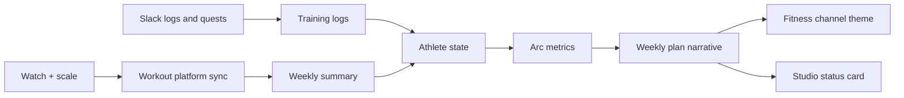

## The question

If I already had a coach that reads fitness load and freshness, then writes my week into a chat channel, why bolt on gate ranks, warrior quotes, and a pixel avatar that looks like it wandered out of a dungeon crawl?

Because the physiology was working and the story was not. I could open the fitness channel on Sunday and see "Wednesday: strides, rate of perceived effort honest, protect Friday long." Correct. Also the emotional warmth of a parking ticket. The numbers lived in a signals list at the bottom. Fitness load 14.87. Freshness +11. Body fat down a kilo. My brain filed them under "spreadsheet" and moved on.

I wanted the same receipts to feel like progress without lying about what they mean.

## The cosplay trap (and how I dodged it)

Arc Mode is not "software thinks you are a hunter." Fantasy skin with zero math is how apps get uninstalled by Wednesday.

The rule I kept: every stat must trace to a sensor or a log line. If the watch stops syncing VO₂max, endurance goes blank instead of inventing a number. If max speed never shows a clean stride sample, speed stays off the card. If I skip lift logs for two weeks, strength stops pretending. If freshness crashes through a hard recovery threshold, the gate seals at rank D and the plan says so in plain English: recovery protocol, not hero Wednesday.

The skin is playful. The plumbing is still the same athlete-state code plus workout-platform sync and Slack effort ratings described in [the first coach essay](/writes/when-the-coach-lives-in-git-and-slack). Arc Mode is a heads-up display on top, committed to git as narrative inside each week's plan file.

## The card: what you actually see

This is the real component, not a screenshot. Hover gate rank, score, or any stat tile for the hints the live UI shows.

<ArcStatusCardDemo />

**Strength** reads session effort from Slack lift logs (48 here because I had only logged one lift). **Agility** is race-speed: Daniels VDOT from the 5K, predicted time on the label. **Speed** is peak velocity from max speed on strides and sprints — neuromuscular top-end, not the 5K. **Endurance** is watch VO₂max. **Vitality** blends freshness, heart-rate variability, and sleep. **Perception** tracks body-fat direction from the scale. The quote line is hashed from the week id, not random. Quest bars bank from short daily practice logs in Slack; note pull-ups already past the ceiling at 34/27.

Each training day gets a narrative skin on the prescription: Monday Patrol, Tuesday strength forge, Wednesday Gate break, Friday Recovery march. Same workout syntax pushed to the watch. Different border color in the UI. Ego responds to "gate break" more than it responds to "strides."

## How the stats evolve (the part that matters)

Block start captures baselines once per training block: VO₂max, fitness load, strength load, weight, body fat, heart-rate variability baseline, 5K personal best. Stats normalize against those anchors so "level 48 strength" means something relative to this block, not a fantasy game table.

Strength climbs when I actually log lifts. Miss logs and it flatlines or proxies off lift week number. The coach literally warns "no lift logs; strength form unknown."

Agility prefers estimated VDOT mapped into the same 0–100 band as the other tiles, with predicted 5K on the label. No recent race? It stays anchored to the personal-best VDOT so a training down-cycle cannot invent a new PB.

Speed is the missing top-end: rolling best max speed from stride and sprint efforts, not the GPS spike on an easy run. It is not a second copy of agility. Race pace is aerobic; peak velocity is neuromuscular. Wednesday strides already train this; the HUD just did not show it.

Endurance is watch VO₂max 1:1. The 30-day delta shows up under the card when the platform has it.

Vitality is the fussy one: half freshness, about a third heart-rate variability versus a two-week baseline, the rest sleep. High fatigue caps the freshness contribution. Cutting hard while form is loading can trigger a vitality critical clamp and seal the gate.

Perception maps body fat inversely. It is explicitly not a beauty score; it tracks composition direction. Weight and body-fat deltas appear when the scale cooperates.

The gate rank is an unweighted mean of the stats that have a sample, then clipped by training phase (build caps at C, sharpen at B, taper at A until race week), then clipped again by readiness locks. Poor cut quality or high fatigue means "Gate sealed; recovery protocol" and rank D max. Sleep debt means "Gate unstable." These are the same cuts that already softened Wednesday. Arc Mode just makes the punishment visible.

## Boss fights, quests, and other optional drama

Quarterly audit sessions spawn when vitality is healthy enough, you are not in taper, and the real race is more than two weeks out. The "boss" targets your lowest stat, or rotates by quarter: a pace session on Wednesday, a heavy lift Tuesday, and so on. It is a narrative rename of benchmark sessions I was going to do anyway. If vitality is shaky, the boss retreats, or foreshadows when an audit is due soon.

Weekly short-practice quests scale with lift week and only appear when the course file enables them. Progress accumulates from Slack quest logs through the week. Sunday deadline is real.

Toggle the whole overlay off by setting narrative to plain in course flags. The planner still respects fitness load and freshness. You just do not get a warrior quote in your face.

## What still breaks

Arc Mode does not fix skipped logs. Strength lied politely at 48 while my legs knew I had been lazy on paper. It does not replace a clinician. It will not read watch-native planned workouts; the path is still platform sync into the watch, not the other way around. Cloud helpers that forget to reset to the published branch will quote stale gate ranks, the same failure mode as stale weeks.

And yes: warrior quotes are cheesy. I kept them because Sunday morning benefits from one line that is not effort math.

## Takeaway

Gate ranks are a compression layer: six numbers and a letter grade that summarize the same athlete state the planner already obeyed, updated when the platform syncs, the scale weighs in, or I type a quest log. Fun enough that I scroll to the top of the week before I scroll to Tuesday squats. Honest enough that a sealed gate hurts because freshness says so, not because a game designer hates me.

Repo: [github.com/AlexTouvras/fitness-coach](https://github.com/AlexTouvras/fitness-coach). Systems loop: [/writes/when-the-coach-lives-in-git-and-slack](/writes/when-the-coach-lives-in-git-and-slack). Architecture: [/architecture/fitness-coach](/architecture/fitness-coach).
