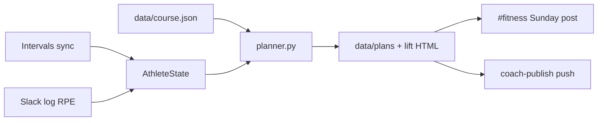

## The question

Why did another watch face and another planning app still leave me arguing with myself every Sunday — and what would it take for the *plan* to show up already decided for the next week?

## Why I built it

I did not need more workouts. I needed a weekly plan updated based on my goals, progress and fatigue.

The recurring failure looked the same: a good race goal on paper (right now a September 5K, PB 22:34), then a week that either stacked hard days because ego felt fresh, or went soft because I "felt" tired with no receipt. Strength and running collided. I'd crush legs on Tuesday and wonder why Wednesday quality felt like wet cement. ChatGPT-style planning made it worse in a friendly way — every Sunday I re-explained constraints the model had already "agreed" to last week, then lost the thread in scrollback.

So I built a coach for one athlete: me. Not a product. A closed loop. Garmin feeds Intervals.icu. The repo holds profile, principles, plans, and lift logs. Cursor Automations run the Sunday job, a daily sync, and a chat router. Slack `#fitness` is the phone UI. My job shrinks to three verbs: **train**, **`log:`** what I did, and occasionally **`intent:`** when life changes the path.

The point of the system is life-shaped. If the week is already on my phone with a "why," I stop burning morning willpower on planning theatre.

Repo: [github.com/AlexTouvras/fitness-coach](https://github.com/AlexTouvras/fitness-coach). Architecture diagrams (with code paths): [/architecture/fitness-coach](/architecture/fitness-coach).

## The science it actually encodes

Nothing here invents a new physiology paper. The repo's `research/` pack is blunt about the lineage: easy/hard distribution ([Seiler-style](https://doi.org/10.1123/ijspp.5.3.276) "most volume stays conversational" rule), classic recreational 5K shape (one quality focus, one longer easy run, taper in the last week — Daniels' *Running Formula* framing), and [concurrent-training spacing](https://link.springer.com/article/10.1007/s40279-021-01587-7) so strength does not sabotage the key run.

The non-negotiables live in `research/principles.md` and get cited in the weekly plan:

1. Progressive overload *with* recovery — stress, then adapt; do not stack hard days because the calendar looks empty.
2. Easy days stay easy — protect the quality session; most running volume is conversational.
3. Readiness beats ego — Intervals form (CTL / ATL / TSB) plus sleep/HRV flags and Slack RPE can force a quality cut.
4. One primary focus per block — during the 5K mesocycle, lifting is maintenance, not a second peaking sport.
5. Concurrent spacing — no lower-body grinders the day before Wednesday quality.
6. Honest logs — silent no-shows corrupt progression; the coach cannot invent what you did not write.
7. Cite why — every week lists the signals that fired, not vibes.

On the numbers side, running form comes from [Intervals' Fitness chart](https://forum.intervals.icu/t/fitness-page-a-guide-to-getting-started/17702) (CTL / ATL / TSB): chronic load, acute load, and form as TSB ≈ CTL − ATL. Zones are wired: fresh, productive, loading, high fatigue. If form is `high_fatigue` or TSB ≤ −20, AthleteState sets `cut_quality` and Wednesday stops pretending to be a hero session.

Strength does not get a free pass. Lifts rarely land as WeightTraining in my Intervals pull, so the coach builds a [Foster-style session-RPE load](https://europepmc.org/article/MED/11708692) (`RPE × minutes / 10`) and a local [Banister EWMA](https://pmc.ncbi.nlm.nih.gov/articles/PMC4213373/) (strength CTL ~28d, ATL ~7d). High recent lift RPE or strength high-fatigue flips `ease_lower_lift` so Tuesday softens before Wednesday. That is the whole joke of concurrent training in one rule: protect the session that pays the race.

Phases are calendar-dumb on purpose. More than 21 days to the event → build. Inside 21 → sharpen. Inside 7 → taper (keep Mon/Wed/Fri anchors, cut volume, keep a little sharpness). The race does not get a motivational speech; it gets a different template.

## Three Slack prefixes (not one chat thread)

The biggest upgrade since the first version: **routing**. Slack is not a diary. Prefixes decide what git is allowed to change.

| Prefix | What it does | Example |
|--------|----------------|---------|
| `log:` | Session writeback only — RPE debt, strength form | `log: lift \| squat 3x5 @ RPE 7` |
| `intent:` | Path tweak for *this block* — writes `data/course.json`, regenerates the week | `intent: 5K is a fitness test, not chasing sub-22; lean into strength` |
| `goal:` | Mesocycle swap — proposal until I approve in a follow-up | `goal: after 5K switch primary to hypertrophy 8 weeks` |

`intent:` was the missing layer. Life does not always need a new `block_id`. Sometimes I need "newborn week — keep sessions short" or "simplify Tue/Thu to one lift" without throwing away the whole 5K pack. `coach-intent` merges that into `data/course.json`, patches profile flags, and regenerates `data/plans/YYYY-Www.json` — without bumping the lift week or pushing Intervals unless the plan actually changed.

`log:` never rewrites the program. That separation matters. Otherwise every tired Tuesday note becomes a program edit.

## How a weekly program gets generated

Sunday Automation runs `coach-week`, posts Slack, then **`coach-publish`** — commit and push `data/` to `master`. Slack alone is not done. I learned that the hard way when a cloud agent posted a beautiful week that never landed in git.

Roughly:

1. **Sync.** Pull Intervals activities, wellness, and calendar into a committed summary. Rebuild AthleteState from that summary plus recent Slack logs (RPE ≥ 9, sore/travel/sick hints, strength session-RPE) and the current `data/course.json`.
2. **Know the block.** Profile says primary goal + `block_id` (today: `5k-2026-09`). Research pack for that block locks run days Mon / Wed / Fri and lift days Tue / Thu.
3. **Pick the skeleton.** Build, sharpen, or taper week: Monday easy run, Tuesday lower-biased lift, Wednesday strides/quality, Thursday upper-biased lift, Friday long easy, optional Saturday easy bike, Sunday rest.
4. **Respect the calendar.** If Intervals already has a run on a locked run day, reuse it. Garmin-native plans are not readable through the API, so the coach never pretends it can import watch scribbles; when the calendar is empty it generates and pushes Intervals → Garmin.
5. **Apply readiness edits.** `cut_quality` turns Wednesday into easy + strides. `ease_lower_lift` annotates Tuesday. Body-comp flags from the scale (only meaningful 7d/14d swings) can reinforce "fuel and recover," not an in-season cut.
6. **Generate strength.** Coach-owned templates (`data/library/coach_wN_*.json`) write Tue/Thu JSON plus an HTML page I can print for the gym. Form-check YouTube links come from a Heimdall snapshot (`exercise_videos.json`) joined by lift name at render time — same clips I embed in Orbit's private week log.
7. **Kickoff.** Before Mon–Sun, the Slack post gets a rotating quote, one Heimdall motivate clip, and Spotify run/strength playlists (`week_boost.py`). Motivation is separate from physiology; both show up on the phone.
8. **Publish.** Save `data/plans/YYYY-Www.json`, bump the lift week, commit, push, and post markdown: kickoff, day-by-day sessions, lift bullets, and **Why this week** from the signals list.

That last line matters. The plan is allowed to change my ego. If form says cut quality, Wednesday becomes easier *and the post says so*.

Midweek can re-check readiness (`coach-midweek`). Daily 07:00 sync refreshes summary + AthleteState without rewriting the week. Sunday still owns the story.

## What this does to an ordinary week

Sunday morning: a message lands in `#fitness` channel while coffee is still optional. Kickoff motivational clip, quote, playlists shared in the same space — then Mon–Sun plan reachable on the phone. No Notion tab. No "what should I do this week" thread with myself.

Gym days: open the lift bullets or the HTML export. Squats, RDLs, split squats — already sized for maintenance so Wednesday is not a crime scene. If last week's `log: lift | … RPE 9` showed up, Tuesday may already be softer. That is the system paying me back for honesty.

Run days: the watch already has the session when the push worked. Easy means easy. Quality means the one hard thing. If life shifts — sleep deprivation, travel, a race that became a fitness test — I send `intent:` once and the week rewrites with a receipt, not a vibes negotiation in my head.

The life win is boring in the best way. Decision tax drops. Concurrent training stops being two sports fighting in the same body. Bad weeks get a rule instead of a mood. After the 5K I can archive the block, flip lifting intent toward hypertrophy, and keep the same Automations — durable loop, replaceable goal pack.

What still hurts: if I skip lift logs, strength form is fog. Slack is uglier than a native training app. Cloud agents go stale unless they hard-reset to `master` before they speak. Sharp pain still means stop and see a clinician; the coach will not play doctor.

## Research the pack draws on

Named methods only — not a literature review. Primary pack: [`research/principles.md`](https://github.com/AlexTouvras/fitness-coach/blob/master/research/principles.md) and block READMEs under [`research/blocks/`](https://github.com/AlexTouvras/fitness-coach/tree/master/research/blocks).

- **[Seiler (2010)](https://doi.org/10.1123/ijspp.5.3.276)** — most endurance volume stays easy; hard days stay hard. I borrow the distribution, not a purity contest about polarized vs pyramidal labels.
- **[Foster session-RPE (2001)](https://europepmc.org/article/MED/11708692)** — internal load = RPE × session duration; what the coach uses when Intervals has no lift activities.
- **[Banister / PMC load models](https://pmc.ncbi.nlm.nih.gov/articles/PMC4213373/)** — EWMA fitness/fatigue on that load; same family as Intervals CTL/ATL, with separate τ for strength in `form_metrics.py`.
- **[Intervals.icu Fitness chart](https://forum.intervals.icu/t/fitness-page-a-guide-to-getting-started/17702)** — running CTL/ATL/TSB from wellness sync; `cut_quality` at TSB ≤ −20.
- **[Schumann et al. (2022)](https://link.springer.com/article/10.1007/s40279-021-01587-7)** — concurrent aerobic + strength: spacing beats denial; same-day stacking hurts explosive work more than maintenance lifting on alternate days.
- **Daniels' *Running Formula*** — recreational 5K phase shape (quality + long easy + taper). Book, not a URL; pace anchors live in [`research/5k-pace-anchors.md`](https://github.com/AlexTouvras/fitness-coach/blob/master/research/5k-pace-anchors.md).

## Takeaway

I built this so the week arrives already argued — by CTL/TSB, RPE debt, block research, and an explicit `intent:` when life moves — not by Monday motivation. The science is old and specific. The generation path is mechanical. The payoff is ordinary life: less negotiation, more showing up, and a written reason when the plan tells ego to sit down.

For diagrams, data ownership tables, and the full automation loop, see [/architecture/fitness-coach](/architecture/fitness-coach).
