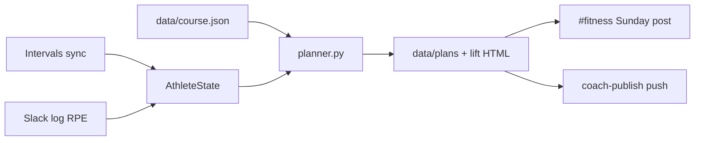

## The question

Why did another watch face and another planning app still leave me arguing with myself every Sunday, and what would it take for the *plan* to show up already decided for the next week?

## Why I built it

I didn't need more workouts. I needed a week that updates when goals, progress, and fatigue change.

The failure looked the same each time. A race goal on paper (right now a September 5K, PB 22:34), then a week that stacked hard days because ego felt fresh, or went soft because I "felt" tired with no receipt. Strength and running collided: crush legs on Tuesday, then Wednesday quality feels like wet cement. Chat-style planning made it worse in a friendly way. Every Sunday I re-explained constraints the model had already "agreed" to last week, then lost the thread in scrollback.

So I built a coach for one athlete: me. Not a product, a closed loop. Garmin feeds Intervals.icu. The repo holds profile, principles, plans, and lift logs. Cursor Automations run the Sunday job, a daily sync, and a chat router. Slack `#fitness` is the phone UI. I train, I `log:` what I did, and sometimes I send `intent:` when life changes the path.

If the week is already on my phone with a "why," I stop spending morning willpower on planning theatre.

This is personal-ops engineering (git, automations, deterministic rules), not a training diary. Repo: [github.com/AlexTouvras/fitness-coach](https://github.com/AlexTouvras/fitness-coach). Diagrams and data ownership: [/architecture/fitness-coach](/architecture/fitness-coach).

## The science it actually encodes

Nothing here invents a physiology paper. The `research/` pack is blunt about the lineage: [Seiler-style](https://doi.org/10.1123/ijspp.5.3.276) easy/hard distribution (most volume stays conversational), recreational 5K shape from Daniels' *Running Formula* (one quality focus, one longer easy run, taper in the last week), and [concurrent-training spacing](https://link.springer.com/article/10.1007/s40279-021-01587-7) so strength does not sabotage the key run. The non-negotiables live in [`research/principles.md`](https://github.com/AlexTouvras/fitness-coach/blob/master/research/principles.md) and get cited in the weekly plan: overload with recovery, easy days stay easy, readiness beats ego, one primary focus per block, honest logs, cite why.

Running form comes from [Intervals' Fitness chart](https://forum.intervals.icu/t/fitness-page-a-guide-to-getting-started/17702): chronic load (CTL), acute load (ATL), form as TSB ≈ CTL − ATL. Zones are wired (fresh, productive, loading, high fatigue). If form is `high_fatigue` or TSB ≤ −20, AthleteState sets `cut_quality` and Wednesday stops pretending to be a hero session.

Lifts rarely land as WeightTraining in my Intervals pull, so strength does not get a free pass. The coach builds a [Foster-style session-RPE load](https://europepmc.org/article/MED/11708692) (`RPE × minutes / 10`) and a local [Banister EWMA](https://pmc.ncbi.nlm.nih.gov/articles/PMC4213373/) (strength CTL ~28d, ATL ~7d). High recent lift RPE or strength high-fatigue flips `ease_lower_lift`, so Tuesday softens before Wednesday. That is concurrent training in one rule: protect the session that pays the race.

Phases are calendar-dumb on purpose. More than 21 days to the event → build. Inside 21 → sharpen. Inside 7 → taper (keep Mon/Wed/Fri anchors, cut volume, keep a little sharpness). The race does not get a speech. It gets a different template.

## Slack is not a diary

The useful upgrade since the first version is routing. Prefixes decide what git is allowed to change.

| Prefix | What it does | Example |
|--------|----------------|---------|
| `log:` | Session writeback only (RPE debt, strength form) | `log: lift \| squat 3x5 @ RPE 7` |
| `intent:` | Path tweak for *this* block: writes `data/course.json`, regenerates the week | `intent: 5K is a fitness test, not chasing sub-22; lean into strength` |
| `goal:` | Mesocycle swap; proposal until I approve in a follow-up | `goal: after 5K switch primary to hypertrophy 8 weeks` |

`intent:` was the missing layer. Life does not always need a new `block_id`. Sometimes I need "keep sessions short" or "simplify Tue/Thu to one lift" without throwing away the 5K pack. `coach-intent` merges that into `data/course.json`, patches profile flags, and regenerates `data/plans/YYYY-Www.json` without bumping the lift week or pushing Intervals unless the plan actually changed.

`log:` never rewrites the program. Otherwise every tired Tuesday note becomes a program edit.

## How a week gets generated

Sunday Automation runs `coach-week`, posts Slack, then **`coach-publish`** (commit and push `data/` to `master`). Slack alone is not done. I learned that when a cloud agent posted a beautiful week that never landed in git.

The mechanical path is short. Sync Intervals activities, wellness, and calendar; rebuild AthleteState from that summary plus recent Slack logs and `data/course.json`. Profile + `block_id` (today: `5k-2026-09`) lock run days Mon/Wed/Fri and lift days Tue/Thu. Readiness flags edit the skeleton: `cut_quality` turns Wednesday into easy + strides; `ease_lower_lift` annotates Tuesday. If Intervals already has a run on a locked day, reuse it. Garmin-native plans are not readable through the API, so when the calendar is empty the coach generates and pushes Intervals → Garmin. Strength comes from coach-owned templates (`data/library/coach_wN_*.json`) plus an HTML page I can print; form-check clips join from a Heimdall snapshot at render time.

The Slack post is the phone UI: kickoff (quote, one motivate clip, playlists), Mon–Sun sessions, lift bullets, and **Why this week** from the signals list. That last line is the point. If form says cut quality, Wednesday becomes easier *and the post says so*.

Daily 07:00 sync refreshes summary + AthleteState without rewriting the week. Midweek can re-check (`coach-midweek`). Sunday still owns the story. The step-by-step loop lives on [/architecture/fitness-coach](/architecture/fitness-coach).

## What this does to an ordinary week

Sunday morning a message lands in `#fitness` while coffee is still optional. Kickoff clip, quote, playlists, then Mon–Sun on the phone. No Notion tab. No "what should I do this week" thread with myself.

Gym days: open the lift bullets or the HTML export. Squats, RDLs, split squats, already sized for maintenance so Wednesday is not a crime scene. If last week's `log: lift | … RPE 9` showed up, Tuesday may already be softer. That is the system paying me back for honesty.

Run days: the watch already has the session when the push worked. Easy stays easy. Quality is the one hard thing. If life shifts (sleep deprivation, travel, a race that became a fitness test), I send `intent:` once and the week rewrites with a receipt, not a vibes negotiation in my head.

Decision tax drops. Concurrent training stops being two sports fighting in the same body. After the 5K I can archive the block, flip lifting toward hypertrophy, and keep the same Automations: durable loop, replaceable goal pack.

What still hurts: skip lift logs and strength form is fog. Slack is uglier than a native training app. Cloud agents invent stale weeks unless they hard-reset to `master` before they speak. Sharp pain still means stop and see a clinician; the coach will not play doctor.

## Research the pack draws on

Named methods only, not a literature review. Canonical list: [`research/principles.md`](https://github.com/AlexTouvras/fitness-coach/blob/master/research/principles.md). Block packs sit under [`research/blocks/`](https://github.com/AlexTouvras/fitness-coach/tree/master/research/blocks).

- **[Seiler (2010)](https://doi.org/10.1123/ijspp.5.3.276)** — most endurance volume stays easy; hard days stay hard. I borrow the distribution, not a polarized-vs-pyramidal argument.
- **[Foster session-RPE (2001)](https://europepmc.org/article/MED/11708692)** — internal load = RPE × duration; used when Intervals has no lift activities.
- **[Banister / PMC load models](https://pmc.ncbi.nlm.nih.gov/articles/PMC4213373/)** — EWMA fitness/fatigue on that load; same family as Intervals CTL/ATL, with separate τ for strength in `form_metrics.py`.
- **[Intervals.icu Fitness chart](https://forum.intervals.icu/t/fitness-page-a-guide-to-getting-started/17702)** — running CTL/ATL/TSB; `cut_quality` at TSB ≤ −20.
- **[Schumann et al. (2022)](https://link.springer.com/article/10.1007/s40279-021-01587-7)** — concurrent aerobic + strength; spacing beats same-session stacking.
- **Daniels' *Running Formula*** — recreational 5K phase shape. Book, not a URL; pace anchors in [`research/5k-pace-anchors.md`](https://github.com/AlexTouvras/fitness-coach/blob/master/research/5k-pace-anchors.md).

## Takeaway

I built this so the week arrives already argued (CTL/TSB, RPE debt, block research, and an explicit `intent:` when life moves), not by Monday motivation. The science is old and specific. The generation path is mechanical. The payoff is ordinary: less negotiation, more showing up, and a written reason when the plan tells ego to sit down.
