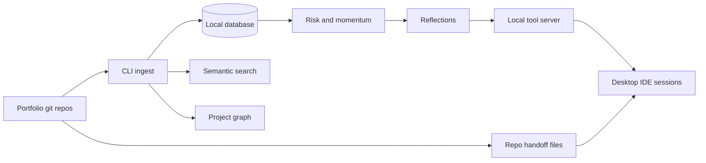

## The question

I keep more than a dozen active project folders open across a normal month: a public site, analytics studies, a fitness coach, field-study cards, a meal planner, a knowledge vault, and a few half-finished experiments that still deserve an honest status. Every new chat starts cold. The assistant is helpful and fast. It has no idea what I decided last Tuesday unless I paste it back in.

That gap used to push me toward a meta-orchestrator: a local control plane with a CEO loop, child agents, and a ledger. I built one. I retired it in July 2026. The operating model that stuck is simpler. Rules and skills live inside each product repo. On top of that sits a portfolio memory that tools can query. ProjectBrain is that memory: a local store of decisions, patterns, and project health, not a second boss.

## What chat memory cannot do

Chat history is a transcript, not a system of record. It does not survive switching folders. It does not rank which project is drifting. It cannot tell a new session that one job-search repo shipped because the human-and-helper loop stayed tight, while a paused game repo shares similar tools but different momentum.

The failure mode is subtle. You re-explain charter constraints the model already agreed to. You repeat an architectural decision because it lived in a thread you closed. You start a "quick fix" on the public site without remembering that weekly blog publish must stay fail-closed on the default branch. None of that is model stupidity. It is missing institutional memory.

File-based state helped first. Each repo now carries a current-state file so helpers read disk before they improvise. That fixed single-repo amnesia. It did not fix portfolio questions: which patterns repeat across winners, which repos are at risk, what a new project should steal from a shipped career tool versus a paused media experiment.

## Two layers: repo truth and portfolio brain

ProjectBrain sits on top of git artifacts, not instead of them.

**Repo layer (durable, diffable):** charters, READMEs, architecture indexes, agent logs, decisions recorded in markdown. Automations that run in the cloud read these files in GitHub. They do not get the local portfolio brain.

**Portfolio layer (queryable, scored):** a local database with semantic search and a graph of technologies, risks, and neighbors. Ingest pulls charter text and git metadata from registered repos. Intelligence passes compute success, risk, momentum, value, fulfillment, and technical-debt scores. They extract cross-project patterns when at least two projects exist, and they generate checkpoint reflections from evidence instead of vibes.

The split matters for boundaries. Desktop sessions may ask for project context, session handoff, decision logging, playbook extraction, portfolio summary, semantic search, and graph hops. Cloud automations are forbidden from depending on ProjectBrain. They use playbooks and target-repo state only. Cloud cannot see my local home folder. Pretending otherwise is how you get silent failures in an ops channel.

## What it is for in practice

I use ProjectBrain as a bootstrap and a portfolio analyst, not as a second CEO.

At session start, handoff reads the current-state file, the last log entry, and a slim project briefing so a new chat does not open with "what were we building?" At session end, state writes back to disk and optionally records a decision. Chat memory becomes optional. Repo files stay canonical.

For new work, setup registers a charter, scaffolds the docs kit, installs editor rules, seeds current state, and pulls playbook recommendations from configured winner projects. The current references are a shipped career tool and a media pipeline: self-hosted first, no mock pipelines, architecture file updated every shipped phase, collaboration quality treated as a signal rather than a vanity metric.

Mid-flight, a short briefing keeps cost low; full mode adds scores and patterns. Risk assessment surfaces stalled or paused drift. Pattern and semantic search answer "have we solved this before?" across charters and reflections. Plain-language portfolio questions get grounded in stored evidence.

The executive cut is a portfolio summary: status breakdown, at-risk projects, technology correlations, top patterns, pending evolution proposals. That is how I notice, for example, that the same editor shows up across seven projects while paused clusters still correlate with low momentum.

Ops hygiene I actually trust: installer and doctor checks, encrypted export for off-machine sync, backup and restore with auto-backup on session start, an eval harness, feature-flagged evolution adoption with a post-adoption gate, and a monthly digest. The system is local-first tooling, not a hosted memory product. Data lives under a `.projectbrain/` folder on disk. Source: [github.com/AlexTouvras/ProjectBrain](https://github.com/AlexTouvras/ProjectBrain).

## How it shows up in real projects

Orbit is the public face. ProjectBrain is private infrastructure. They meet at the edges.

When I ship a field card, weekly Write, or fitness-coach block, the essay and architecture page are public proof. ProjectBrain holds why the Approve gate exists, which automations must stay propose-only, and which winner-repo practices apply to the next repo. The knowledge vault stays read-only to consumers. The fitness coach owns git writes on Sunday publish. Those boundaries are decisions, not comments in a thread.

The payoff is compounding defaults. Starting an analytics or delivery field-card repo, I do not re-derive "discovery alone is not enough" or "a human Approves blog publish in Slack" from scratch. Playbook extraction reads what worked in shipped repos and proposes constraints for the new charter. The helper still has to implement. ProjectBrain stops it from reinventing governance every Monday.

Counter-case: ProjectBrain does not replace git, CI, or Slack evidence. If current state is stale, slim context lies politely. If ingest has not run, semantic search is empty and the helper should say so. Scores are heuristics. A paused project with high fulfillment can still show low momentum until work lands in repos. I treat the brain as a prioritized briefing, not an oracle.

## Where it is going

Near term, the interesting surface is cross-repo graph queries and evolution scout proposals: curated external research that becomes an adoption proposal with an eval gate, not an automatic dependency bump. Encrypted sync means the portfolio brain can leave the laptop without trusting a cloud vendor with raw decisions.

Longer term, the product is pattern transfer at portfolio scale. More repos should start with winner playbooks, record decisions at handoff time, and let the next session ask "what failed last time we used this editor plus a local database for orchestration?" without opening archaeology on the retired control plane. Old diagrams stay on Orbit as history. The living control plane is rules, skills, repo state, and ProjectBrain in desktop sessions only.

What stays out: cloud agents calling portfolio memory, broker automation claims without evidence, and any workflow where the model's context window is the only source of truth. Chat is a UI. Git plus local intelligence is the record.

## Takeaway

If you run multiple projects with AI helpers, the bottleneck stops being model quality and becomes memory architecture: what is on disk per repo, what is queryable across repos, and which runtime is allowed to see which layer. ProjectBrain is my answer after retiring a heavier orchestrator. Keep repo truth in git. Keep portfolio learning in a local brain helpers can query. Keep cloud automations dumb on purpose. The helper gets smarter when the record survives the chat close button.

Architecture diagrams: [/architecture/projectbrain](/architecture/projectbrain).
