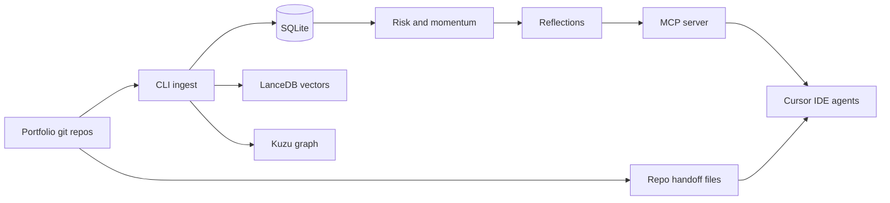

## The question

I run more than a dozen active repos in Cursor: Orbit, Power BI portfolio work, fitness coach, field cards, mealplan, ravens, and the half-finished experiments that still deserve an honest status. Every session starts cold. The model is helpful, fast, and has no idea what I decided last Tuesday unless I paste it back in.

That gap used to send me toward a meta-orchestrator. ProjectHelm / JARVIS was a local control plane with a CEO loop, child agents, and a ledger. I retired it in July 2026. The operating model that actually stuck is simpler: Cursor rules and skills inside each product repo, plus a portfolio memory that agents can query through MCP. ProjectBrain is that memory.

## What chat memory cannot do

Chat history is a transcript, not a system of record. It does not survive repo switches, it does not rank which project is drifting, and it cannot tell a new agent that careerops shipped because the human+agent loop stayed tight while a paused game repo shares the same `cursor` + `sqlite` community but different momentum.

The failure mode is subtle. You re-explain charter constraints the model already agreed to. You repeat an architectural decision because it lived in a thread you closed. You start a "quick fix" in Orbit without remembering that weekly Write Approve must stay fail-closed on GitHub default branch. None of that is model stupidity; it is missing institutional memory.

File-based state helped first. Each repo now carries `.state/` or `docs/CURRENT_STATE.md` so agents read disk before they improvise. That fixed single-repo amnesia. It did not fix portfolio questions: which patterns repeat across winners, which repos are at risk, what a new project should steal from careerops versus Reelsmaker.

## Two layers: repo truth and portfolio brain

ProjectBrain sits on top of git artifacts, not instead of them.

**Repo layer (durable, diffable):** charters, READMEs, architecture indexes, agent logs, decisions recorded in markdown. Orbit's `.state/` protocol is the same idea under a different folder name. Automations and cloud agents read these files on GitHub; they do not get ProjectBrain MCP.

**Portfolio layer (queryable, scored):** a local SQLite store with an event outbox, LanceDB vectors for semantic search, and a Kùzu graph projection for multi-hop questions (technologies, risks, neighborhoods). Ingest pulls charter text and git metadata from registered repos. Intelligence passes compute success, risk, momentum, value, fulfillment, and technical-debt scores; extract cross-project keyword patterns when at least two projects exist; generate checkpoint reflections from evidence instead of vibes.

The split matters for boundaries. IDE sessions may call `get_project_context`, `get_session_handoff`, `record_decision`, `extract_playbook`, `get_portfolio_summary`, `semantic_search`, and `traverse_graph`. Cursor Automations that run in the cloud are explicitly forbidden from depending on ProjectBrain; they use playbooks and target-repo state only. Cloud cannot see `~/.cursor`. Pretending otherwise is how you get silent failures in `#ops-channel`.

## What agents can do with it today

I use ProjectBrain as a bootstrap and a portfolio analyst, not as a second CEO.

**Session start:** `get_session_handoff` reads `docs/CURRENT_STATE.md`, the last `AGENT_LOG` entry, and slim project context so a new chat does not open with "what were we building?" **Session end:** `end_session_handoff` writes state back to disk and optionally records a decision. Chat memory becomes optional; repo files stay canonical.

**New work:** `setup_new_project` registers a charter, scaffolds the docs kit, installs Cursor rules, seeds CURRENT_STATE, and pulls playbook recommendations from configured winner projects. careerops and Reelsmaker are the current references: self-hosted first, no mock pipelines, architecture file updated every shipped phase, collaboration quality treated as a signal not a vanity metric.

**Mid-flight:** `get_project_context` in slim mode keeps token cost low; full mode adds scores and patterns. `assess_risk` surfaces stalled or paused drift. `search_patterns` and `semantic_search` answer "have we solved this before?" across charters and reflections. `explain_outcomes` takes a plain-language portfolio question and grounds it in stored evidence.

**Portfolio view:** `get_portfolio_summary` is the executive cut: status breakdown, at-risk projects, technology correlations, top patterns, pending evolution proposals. That is how I notice, for example, that cursor shows up across seven projects but paused clusters still correlate with low momentum.

Milestone 4 added the ops hygiene I actually trust: installer and `doctor`, encrypted export for off-machine sync, backup/restore with auto-backup on session start, eval harness, feature-flagged evolution adoption with a post-adoption gate, and a monthly digest. The system is local-first MIT tooling (`py -m projectbrain setup`), not a hosted memory SaaS. Data lives under `.projectbrain/` on disk. Source: [github.com/AlexTouvras/ProjectBrain](https://github.com/AlexTouvras/ProjectBrain).

## How it shows up in real projects

Orbit is the public face; ProjectBrain is private infrastructure. They meet at the edges.

When I ship a field card, weekly Write, or fitness-coach block, the essay and architecture page are public proof. ProjectBrain holds why the Approve gate exists, which automations must stay propose-only, and which winner-repo practices apply to the next repo. Ravens stays read-only to consumers; fitness-coach owns git writes on Sunday publish. Those boundaries are decisions, not comments in a thread.

The payoff is compounding defaults. Starting a analytics or delivery field-card repo, I do not re-derive "discovery alone is not enough" or "human Approves in Slack #orbit" from scratch. Playbook extraction reads what worked in shipped repos and proposes constraints for the new charter. The agent still has to implement; ProjectBrain stops it from reinventing governance every Monday.

Counter-case: ProjectBrain does not replace git, CI, or Slack evidence. If CURRENT_STATE is stale, slim context lies politely. If ingest has not run, semantic search is empty and the agent should say so. Scores are heuristics; a paused project with fulfillment 0.84 (ProjectBrain itself) still shows low momentum until work lands in repos. I treat the brain as a prioritized briefing, not an oracle.

## Where it is going

Near term, the interesting surface is cross-repo graph queries and evolution scout proposals: curated external research that becomes an adoption proposal with an eval gate, not an automatic dependency bump. Encrypted sync means the portfolio brain can leave the laptop without trusting a cloud vendor with raw decisions.

Longer term, the product is pattern transfer at portfolio scale. More repos should start with winner playbooks, record decisions at handoff time, and let the next agent ask "what failed last time we used cursor + sqlite for orchestration?" without opening JARVIS archaeology. JARVIS diagrams stay on Orbit as history; the living control plane is rules, skills, repo state, and ProjectBrain MCP in IDE sessions only.

What stays out: cloud agents calling portfolio memory, broker automation claims without evidence, and any workflow where the model's context window is the only source of truth. Chat is a UI. Git plus local intelligence is the record.

## Takeaway

If you run multiple agentic repos, the bottleneck stops being model quality and becomes memory architecture: what is on disk per repo, what is queryable across repos, and which runtime is allowed to see which layer. ProjectBrain is my answer after retiring a heavier orchestrator: keep repo truth in git, keep portfolio learning in a local brain agents can query, and keep cloud automations dumb on purpose. The agent gets smarter when the record survives the chat close button.

Architecture diagrams: [/architecture/projectbrain](/architecture/projectbrain).
